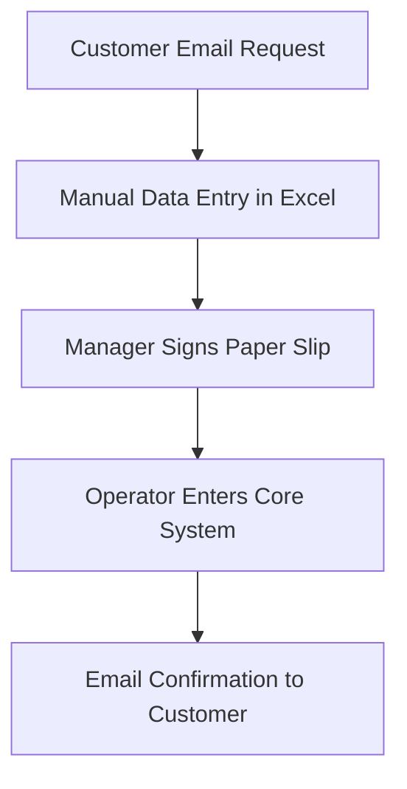
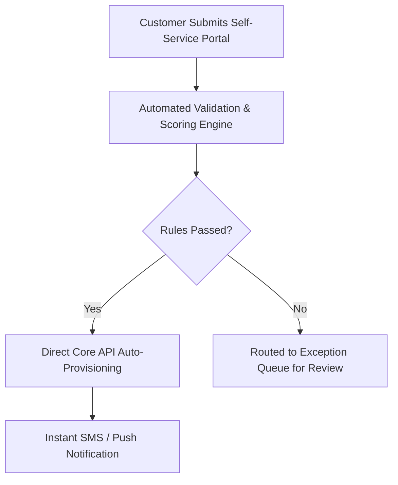

# Business Requirements Document (BRD) Template

> **Standard:** Enterprise BRD Framework for Strategic Initiatives, ROI Assessment & Stakeholder Governance.

---

## 1. Document Control
* **Project Name:** [Project Name]
* **Project Code:** [e.g., BRD-2026-PAY-01]
* **Document Owner:** [Lead Business Analyst]
* **Sponsor / Business Unit:** [e.g., Digital Banking / E-commerce Division]
* **Version:** 1.0 (Final Draft)

### Revision History
| Version | Date | Author | Description of Changes |
| :--- | :--- | :--- | :--- |
| 1.0 | 2026-09-23 | BA Lead | Initial Baseline Requirement Document |

---

## 2. Business Case & Executive Summary

### 2.1 Strategic Alignment & Business Objectives
* **Strategic Driver:** [Why does the business need to invest in this solution now?]
* **Business Opportunity:** [What market share or revenue opportunity will this unlock?]
* **Core Problem Statement:** [Detailed breakdown of current operational loss / inefficiencies.]

### 2.2 Cost-Benefit Analysis & Expected ROI
| Item | Current Cost (Manual / Legacy) | Projected Cost (New System) | Net Benefit / Savings |
| :--- | :--- | :--- | :--- |
| Annual Operational Cost | $120,000 / year | $35,000 / year | **+$85,000 / year** |
| Processing Time per Case | 45 minutes | 30 seconds | **98.8% Time Reduction** |

---

## 3. Current State vs. Future State (As-Is vs. To-Be)

### 3.1 As-Is Business Process

### 3.2 To-Be Automated Process

---

## 4. Business Requirements & Policies

### 4.1 Business Rules & Governance (BR)
* **`BR-01 (Eligibility Rule):`** Customers must have an active KYC Tier 2 profile and no unpaid debt over 30 days.
* **`BR-02 (Maker-Checker Policy):`** Any transaction exceeding $10,000 must require 2-person authorization before dispatch.
* **`BR-03 (Audit Trail):`** All state transitions and sensitive profile views must be logged permanently in immutable audit storage.

---

## 5. Stakeholder Sign-Off Matrix
| Role | Name | Title | Signature / Approval | Date |
| :--- | :--- | :--- | :--- | :--- |
| Project Sponsor | | Head of Business Unit | `[ APPROVED ]` | 2026-09-23 |
| Lead BA | | Principal Business Analyst | `[ APPROVED ]` | 2026-09-23 |
| Solution Architect | | Head of Engineering | `[ APPROVED ]` | 2026-09-23 |
