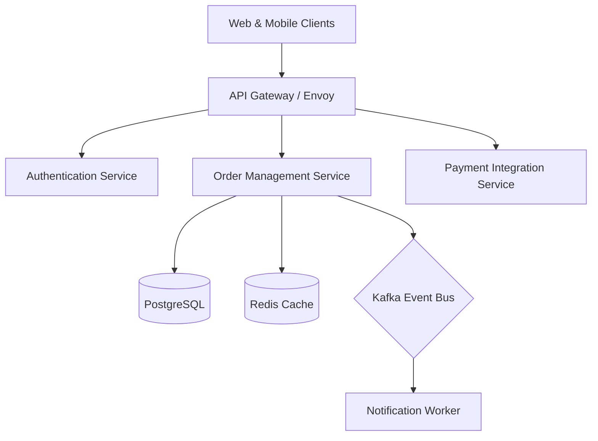

# Software Requirements Specification (SRS) & FRD Template

> **Standard:** IEEE 830 / ISO/IEC/IEEE 29148 Standard for Software Requirements Specification.

---

## 1. Introduction
* **System Purpose:** [Detailed technical specification of software capabilities, interfaces, and architecture constraints.]
* **Intended Audience:** Backend Engineers, Frontend Engineers, DevOps/SRE, QA Automation Engineers.

---

## 2. System Architecture & High-Level Design

### 2.1 Microservices & Component Interaction


---

## 3. Functional Requirements Specification (API Contracts & Logic)

### 3.1 Module: Order Checkout Service

#### Endpoint: `POST /api/v1/orders/checkout`
* **Protocol:** HTTPS / REST / JSON
* **Authentication:** `Bearer <JWT_TOKEN>` (Header: `Authorization`)
* **Idempotency:** Header `X-Idempotency-Key: <UUIDv4>` (Required)

#### Request Payload Specification:
```json
{
  "customer_id": "9b1deb4d-3b7d-4bad-9bdd-2b0d7b3dcb6d",
  "shipping_address_id": "3fa85f64-5717-4562-b3fc-2c963f66afa6",
  "payment_method": "VNPAY_QR",
  "items": [
    {
      "sku": "IPHONE-15-PRO-256",
      "quantity": 1,
      "unit_price": 28990000
    }
  ]
}
```

#### Detailed Validation Rules (Business & System Logic):
1. **Stock Verification:** Check inventory availability in Redis Cache. If `stock < quantity`, return HTTP `409 Conflict` with error code `ERR_INSUFFICIENT_STOCK`.
2. **Price Integrity:** Compare `unit_price` in payload against active catalog database. If altered, abort transaction immediately with `ERR_PRICE_MISMATCH`.
3. **Atomic Reservation:** Acquire distributed lock (`Redlock`) on SKU ID during order creation to prevent race condition.

---

## 4. Non-Functional Requirements (NFRs & SLAs)

| Requirement Dimension | Technical Metric / Threshold | Measurement Method |
| :--- | :--- | :--- |
| **P99 Latency** | $< 200ms$ for Core Query Endpoints, $< 500ms$ for Checkout | Datadog APM / Prometheus |
| **Throughput** | Min 2,500 Requests Per Second (RPS) during Flash Sale | k6 Load Testing Script |
| **Availability / Uptime**| 99.95% ($< 21.6$ minutes downtime / month) | AWS Multi-AZ Deployment |
| **Data Encryption** | AES-256 for PII at rest, TLS 1.3 in transit | AWS KMS / SSL Labs A+ |
| **Database RPO / RTO** | RPO $< 1$ minute (WAL streaming), RTO $< 15$ minutes | Automated RDS Multi-AZ Failover |
