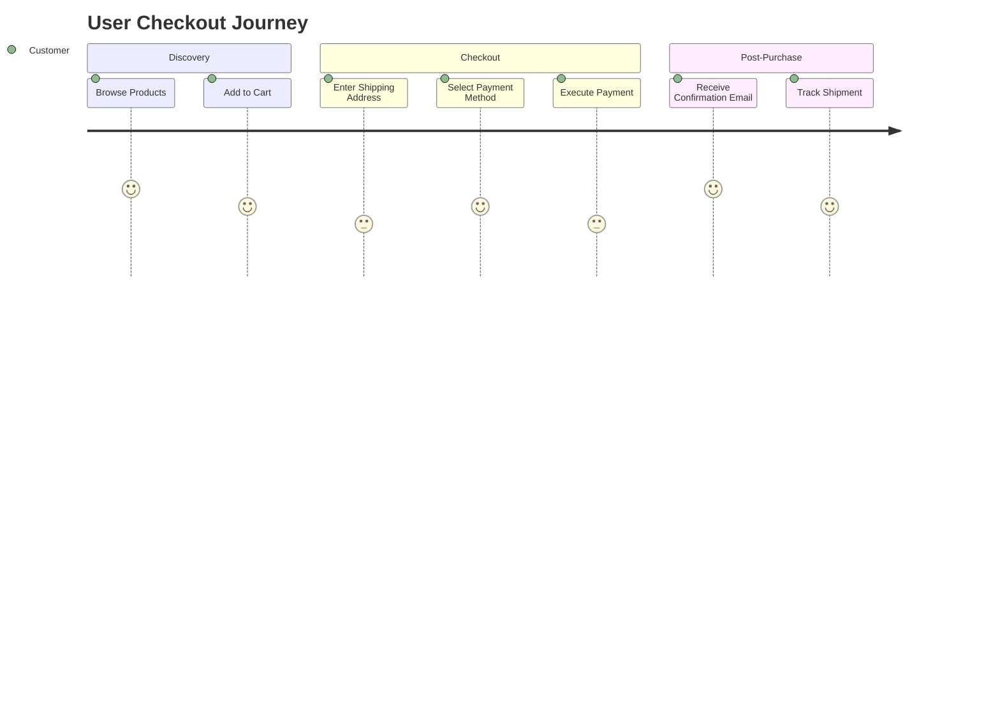
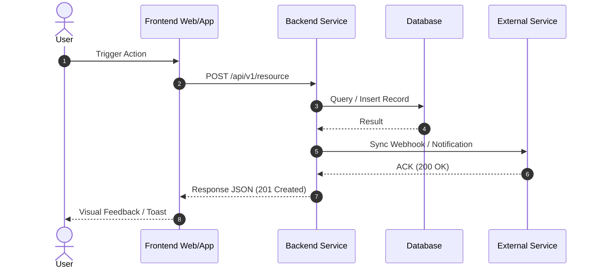
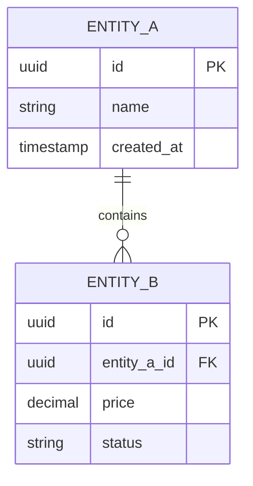

# Product Requirements Document (PRD) Template

> **Standard:** Aligned with BABOK v3, Silicon Valley PM standards, and AI-first engineering workflows.

---

## 1. Document Overview
* **Project Name:** [Project Name]
* **Document Version:** v1.0
* **Author / Business Analyst:** [Author Name / AI BA]
* **Target Audience:** Engineering Team, UI/UX Designers, QA, Business Stakeholders
* **Status:** `Draft` | `In Review` | `Approved` | `Living Document`

---

## 2. Executive Summary & Problem Statement

### 2.1 Problem Description
* **Current State (As-Is):** [What is the current pain point or manual bottleneck?]
* **Root Cause (5 Whys):** [Why does this problem happen?]
* **Target Solution (To-Be):** [High-level summary of what we are building.]

### 2.2 Business Value & KPIs
| Metric / KPI | Baseline (Current) | Target Goal | Timeline |
| :--- | :--- | :--- | :--- |
| e.g., Checkout Conversion Rate | 1.8% | 3.5% | 30 days post-launch |
| e.g., Order Processing Latency | 15 minutes | < 5 seconds | MVP release |

---

## 3. Scope Boundaries (In-Scope vs. Non-Goals)

### ✅ In-Scope (Phase 1 / MVP)
1. [Core capability 1]
2. [Core capability 2]
3. [Core capability 3]

### ⛔ Non-Goals / Out-of-Scope (Explicitly Deferred)
* [Feature X is postponed to Phase 2 to ensure on-time MVP delivery]
* [Legacy migration Y is handled via manual script, not UI]

---

## 4. User Personas & User Journeys

### 4.1 Target Personas
* **Primary Persona:** [e.g., Online Shopper - needs quick checkout without mandatory sign-up]
* **Secondary Persona:** [e.g., Store Admin - needs live inventory sync and webhook audit logs]

### 4.2 User Journey Map


---

## 5. Functional Requirements (EARS & User Stories)

### 5.1 Requirement Specification (EARS Syntax)
* **[REQ-001 - Event-Driven]:** *WHEN* the user submits payment, *THE SYSTEM SHALL* call the payment gateway API within 2000ms.
* **[REQ-002 - State-Driven]:** *WHILE* the inventory stock is 0, *THE SYSTEM SHALL* disable the "Buy Now" button and display "Out of Stock".
* **[REQ-003 - Unwanted Behavior]:** *IF* the payment webhook fails, *THEN THE SYSTEM SHALL* retry with exponential backoff (max 5 attempts).

### 5.2 User Stories & Acceptance Criteria (Gherkin BDD)

#### **US-01: [Feature Title]**
> **As a** [Persona]  
> **I want to** [Perform Action]  
> **So that** [Business Value]

```gherkin
Feature: [Feature Name]

  Background:
    Given System is operating normally
    And User is logged in

  Scenario: Happy Path - Success
    Given User has items in cart
    When User clicks "Place Order"
    Then Deduct inventory stock
    And Create order in "PENDING" status
    And Redirect to Payment Gateway

  Scenario: Edge Case - Insufficient Stock
    Given Product stock is 0
    When User clicks "Place Order"
    Then Display error banner "Item is out of stock"
    And Prevent order creation
```

---

## 6. System Architecture & Process Flows

### 6.1 End-to-End Sequence Flow


---

## 7. Data Model & Entities


---

## 8. Non-Functional Requirements (NFRs)
* **Performance / Latency:** API 95th percentile response time $< 250ms$ under 500 RPS.
* **Security & Compliance:** All sensitive tokens encrypted at rest (AES-256) and in transit (TLS 1.3). OWASP Top 10 compliance.
* **Reliability / Availability:** 99.9% uptime SLA. Automated rollback on deployment health check failure.

---

## 9. Traceability & Sign-Off Matrix (RTM)
| Req ID | User Story ID | API Endpoint / Module | Test Case ID | Status |
| :--- | :--- | :--- | :--- | :--- |
| `REQ-001` | `US-01` | `POST /api/v1/checkout` | `TC-CHK-001` | Planned |
| `REQ-002` | `US-02` | `GET /api/v1/inventory` | `TC-INV-004` | Planned |
