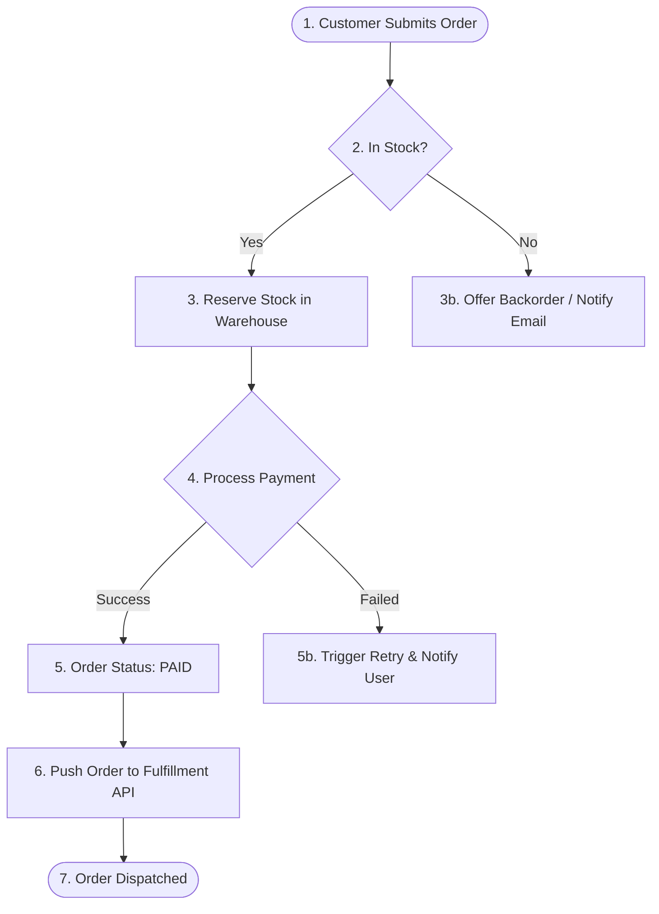
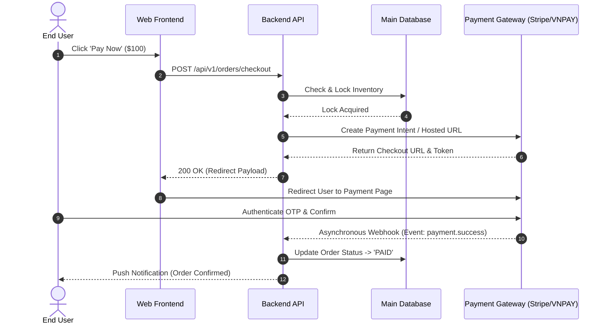
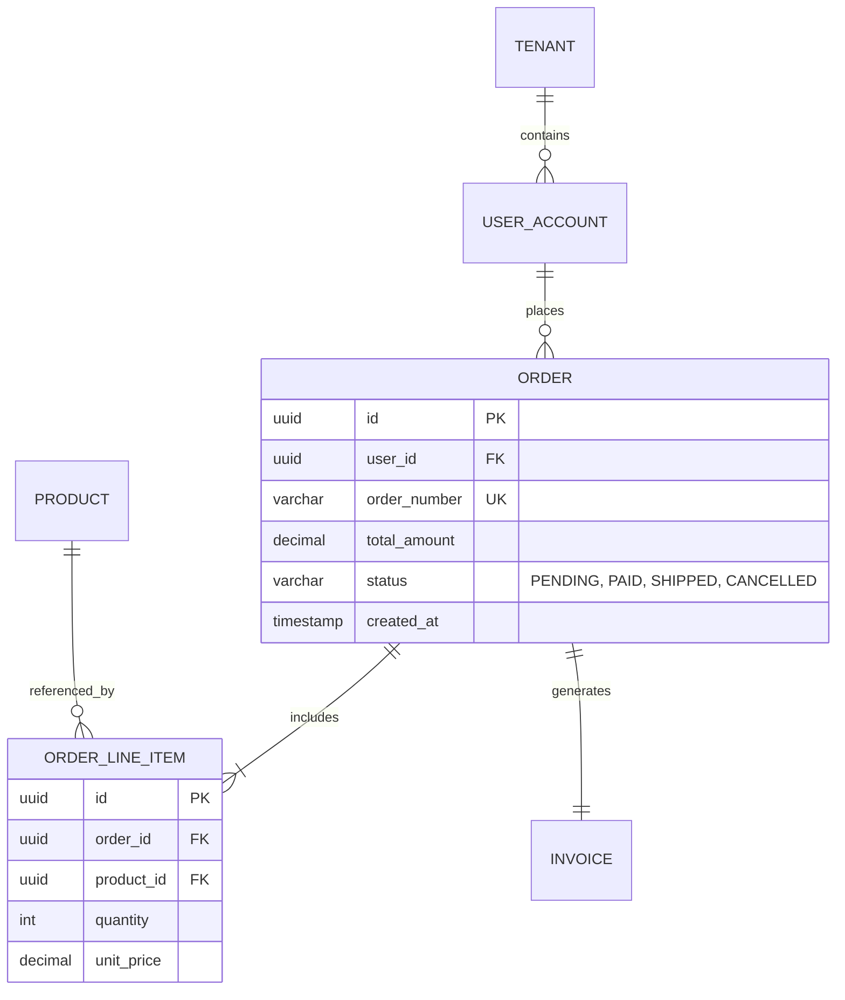
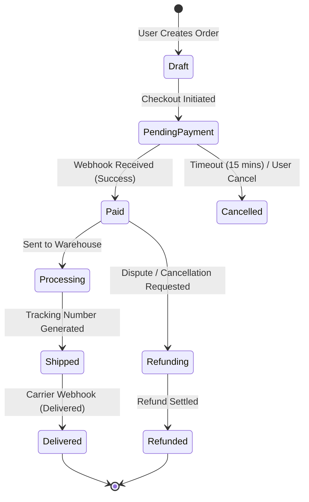

# Mermaid.js Visual Modeling Guide for Business & Systems Analysts

> **Standard:** Render production-grade diagrams directly in Markdown without external drawing tools. Supported natively by GitHub, GitLab, Notion, and AI agent interfaces.

---

## 1. Process Flowchart (`flowchart TD` / `flowchart LR`)
*Use for:* Business workflows, branching decision trees, As-Is vs To-Be process comparisons.

---

## 2. System Sequence Diagram (`sequenceDiagram`)
*Use for:* API communication flows, microservice orchestration, third-party webhook handshakes.

---

## 3. Entity-Relationship Diagram (`erDiagram`)
*Use for:* Database schema definition, domain models, entity mapping for Data Dictionary.

---

## 4. State Machine Diagram (`stateDiagram-v2`)
*Use for:* Tracking lifecycle transitions of business objects (Orders, Tickets, Invoices, KYC status).

