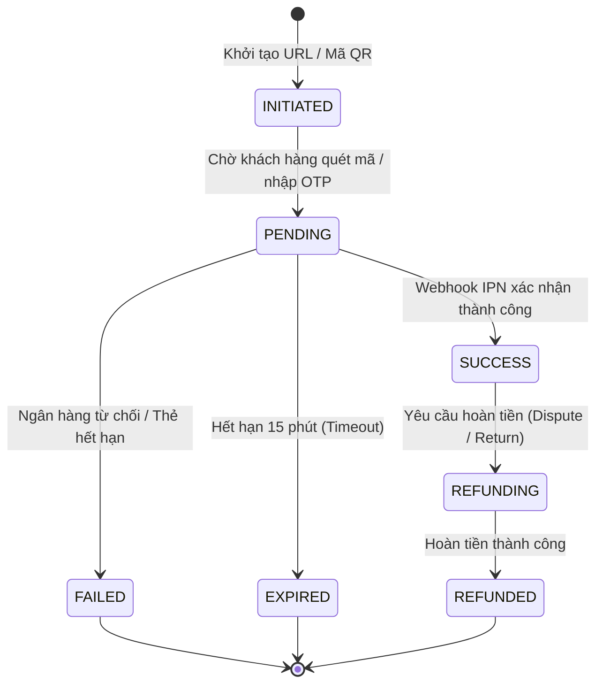

# 📊 Data Dictionary & Schema Catalog Template (Markdown Standard)

> **Standard:** Enterprise Data Governance & Schema Mapping Standard for Business & Systems Analysts.  
> **Purpose:** Chuẩn hóa định nghĩa thực thể, kiểu dữ liệu, ràng buộc (constraints), và quy tắc nghiệp vụ cho Database Tables & API Entities mà không cần phụ thuộc vào Excel.

---

## 1. Entity Overview & Metadata

* **Entity / Table Name:** `payment_transactions`
* **Domain / Module:** Billing & Payments
* **Database Engine:** PostgreSQL 16+
* **Primary Key:** `id` (UUIDv4)
* **Description:** Lưu trữ toàn bộ lịch sử giao dịch thanh toán qua Cổng thanh toán (VNPAY, MoMo, VietQR, Stripe) và kết quả xác thực Webhook IPN.

---

## 2. Detailed Data Dictionary (Field Specifications)

| Field Name | Data Type | Nullable | Default | PK/FK | Index / Unique | Description & Business Rules | Example Value |
| :--- | :--- | :---: | :--- | :---: | :---: | :--- | :--- |
| `id` | `UUID` | No | `gen_random_uuid()` | **PK** | Clustered PK | Khóa chính định danh duy nhất của giao dịch | `9b1deb4d-3b7d-4bad-9bdd-2b0d7b3dcb6d` |
| `order_id` | `UUID` | No | None | **FK** | B-Tree Index | Tham chiếu đến bảng `orders(id)`. 1 Đơn hàng có thể có nhiều giao dịch thử lại | `3fa85f64-5717-4562-b3fc-2c963f66afa6` |
| `transaction_code` | `VARCHAR(64)` | No | None | None | **UNIQUE** | Mã giao dịch sinh bởi hệ thống nội bộ (Format: `TXN-YYYYMMDD-XXXXX`) | `TXN-20260923-00921` |
| `gateway_reference` | `VARCHAR(128)` | Yes | `NULL` | None | B-Tree Index | Mã giao dịch trả về từ cổng đối tác (VD: `vnp_TransactionNo`, `momo_transId`) | `14589201` |
| `payment_method` | `VARCHAR(32)` | No | None | None | None | Phương thức thanh toán. Enum: `VNPAY_QR`, `MOMO_WALLET`, `VIETQR_NAPAS`, `VISA_MASTER` | `VNPAY_QR` |
| `amount` | `DECIMAL(15,2)` | No | None | None | None | Số tiền giao dịch thực tế. Ràng buộc: `amount > 0` | `1250000.00` |
| `currency` | `VARCHAR(3)` | No | `'VND'` | None | None | Đơn vị tiền tệ theo chuẩn ISO 4217 (`VND`, `USD`, `EUR`) | `VND` |
| `status` | `VARCHAR(24)` | No | `'INITIATED'` | None | B-Tree Index | Trạng thái giao dịch. Xem mục 3 State Machine bên dưới | `SUCCESS` |
| `idempotency_key` | `VARCHAR(64)` | No | None | None | **UNIQUE** | Khóa chống trùng lặp request giao dịch (Client sinh UUIDv4) | `idem_8f7b2c9a1d` |
| `signature_verified`| `BOOLEAN` | No | `FALSE` | None | None | Đánh dấu chữ ký số HMAC-SHA512 từ Webhook IPN đã được kiểm tra hợp lệ | `TRUE` |
| `raw_response_payload` | `JSONB` | Yes | `NULL` | None | GIN Index | Lưu toàn bộ payload JSON/Query parameters từ cổng thanh toán để đối soát | `{"vnp_ResponseCode": "00"}` |
| `created_at` | `TIMESTAMPTZ` | No | `NOW()` | None | B-Tree Index | Thời điểm tạo bản ghi (UTC) | `2026-09-23T07:15:30Z` |
| `updated_at` | `TIMESTAMPTZ` | No | `NOW()` | None | None | Thời điểm cập nhật cuối cùng (Trigger tự động update) | `2026-09-23T07:16:02Z` |

---

## 3. State Machine & Lifecycle (Trạng thái giao dịch)

---

## 4. Business Rules & Data Integrity Constraints

1. **Chống trùng lặp (Idempotency):**
   * Trường `idempotency_key` đảm bảo cùng 1 thao tác bấm của khách hàng không sinh ra 2 giao dịch thanh toán trong hệ thống.
2. **Bảo mật PII & PCI-DSS:**
   * Tuyệt đối **không lưu số thẻ tín dụng (PAN), CVV/CVC, hoặc OTP** vào cơ sở dữ liệu. Chỉ lưu Token định danh từ Gateway.
3. **Audit Trail (Lưu vết kiểm toán):**
   * Bảng `payment_transactions` là bảng Append-Only (không xóa vật lý `HARD DELETE`). Khi có thay đổi trạng thái, bắt buộc ghi thêm bản ghi lịch sử vào bảng `transaction_audit_logs`.
