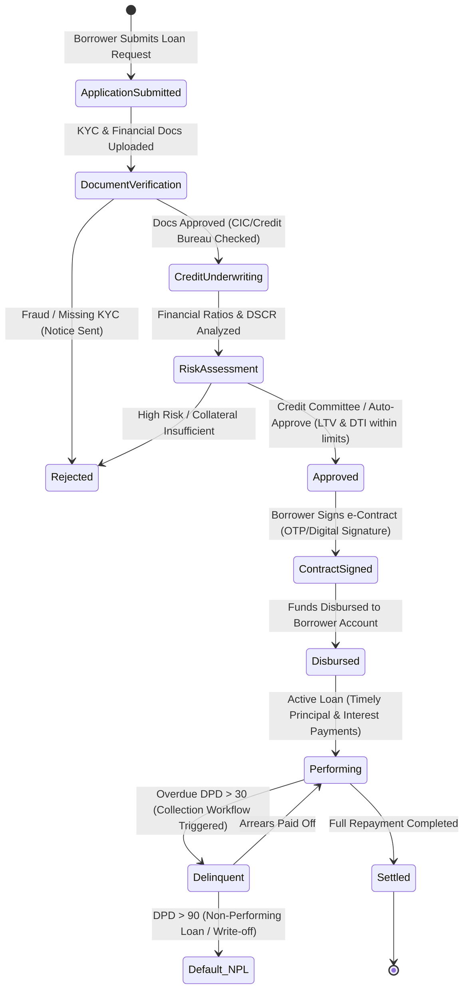
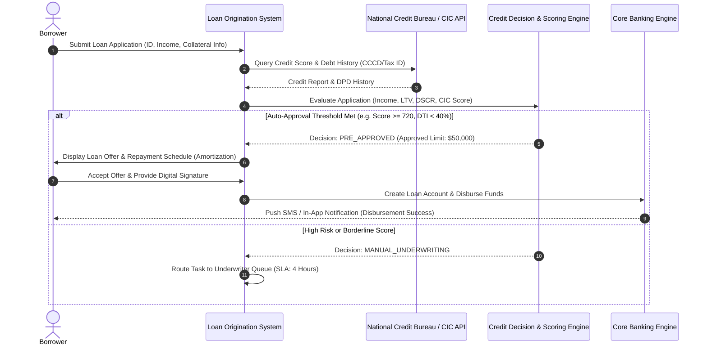

# 🏦 Commercial Lending & Credit Risk Business Analysis Guide

> **Domain:** Corporate & Commercial Lending, Credit Underwriting, Loan Origination System (LOS), and Risk Modeling (Basel III/IV).  
> **Target:** Banking BAs, Risk Analysts, Core Banking & Fintech Engineers.

---

## 1. Loan Origination & Lifecycle State Machine



---

## 2. Core Credit Risk Formulas & Metrics

| Metric | Formula | Standard Threshold | Business Meaning |
| :--- | :--- | :--- | :--- |
| **DTI** (Debt-to-Income) | $\frac{\text{Total Monthly Debt Obligations}}{\text{Gross Monthly Income}} \times 100\%$ | $\le 45\%$ | Khả năng trả nợ dựa trên thu nhập hàng tháng. |
| **LTV** (Loan-to-Value) | $\frac{\text{Loan Amount}}{\text{Appraised Collateral Value}} \times 100\%$ | $\le 70\% - 80\%$ | Tỷ lệ số tiền vay trên giá trị định giá của tài sản đảm bảo. |
| **DSCR** (Debt Service Coverage) | $\frac{\text{Net Operating Income (NOI)}}{\text{Total Debt Service}}$ | $\ge 1.25\times$ | Khả năng doanh nghiệp tạo ra dòng tiền đủ trả lãi và gốc. |
| **EL** (Expected Loss) | $\text{PD} \times \text{LGD} \times \text{EAD}$ | Basel Standard | Tổn thất kỳ vọng: Xác suất vỡ nợ $\times$ Tỷ lệ mất vốn $\times$ Dư nợ lúc vỡ nợ. |

---

## 3. End-to-End Loan Origination Sequence



---

## 4. EARS Functional Requirements & Gherkin Scenarios

### EARS Requirements
* **[REQ-LEND-001 - Event-Driven]:** *WHEN* borrower submits loan application, *THE SYSTEM SHALL* call Credit Bureau API within 3000ms.
* **[REQ-LEND-002 - State-Driven]:** *WHILE* loan status is `DISBURSED`, *THE SYSTEM SHALL* accrue daily interest based on 365-day year convention.
* **[REQ-LEND-003 - Unwanted Behavior]:** *IF* borrower DPD (Days Past Due) exceeds 90 days, *THEN THE SYSTEM SHALL* automatically classify loan as Group 3 (Substandard / NPL).

### Gherkin BDD Scenarios
```gherkin
Feature: Loan Origination Automated Credit Decisioning

  Scenario: Instant Approval for High Credit Score Borrower
    Given Borrower gross income is $6,000 / month
    And Existing monthly debt obligations are $1,200 (DTI = 20%)
    And CIC Credit Bureau returns Credit Score 780 with 0 historical DPD
    When Borrower requests a personal loan of $20,000 for 24 months
    Then The Credit Engine shall return status "AUTO_APPROVED"
    And The system shall generate Amortization Schedule with 9.5% annual interest

  Scenario: Automatic Rejection for Excessive Debt-to-Income (DTI > 50%)
    Given Borrower gross income is $3,000 / month
    And Existing monthly debt obligations are $1,800 (DTI = 60%)
    When Borrower applies for additional $15,000 loan
    Then The Credit Engine shall return status "REJECTED"
    And The system shall log reason "ERR_DTI_EXCEEDS_MAX_THRESHOLD"
```
