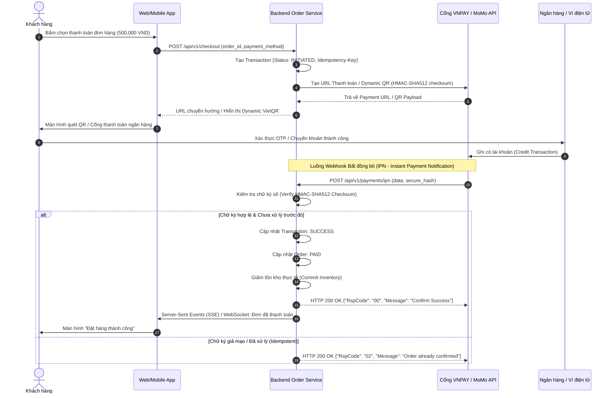

# 🇻🇳 Case Study Đặc thù: Hệ thống E-Commerce & Cổng Thanh toán Việt Nam (VNPAY / MoMo / ZaloPay & VietQR)

> **Mục đích:** Tài liệu mẫu đặc tả nghiệp vụ thực chiến theo chuẩn thanh toán và thương mại điện tử tại thị trường Việt Nam (tích hợp Cổng thanh toán, Dynamic VietQR, Webhook IPN, và Đối soát dòng tiền).

---

## 1. Bối cảnh & Mô hình nghiệp vụ (Business Context)

### 1.1 Luồng thanh toán trực tuyến tại Việt Nam
Tại thị trường Việt Nam, hệ thống E-commerce cần hỗ trợ 4 phương thức thanh toán chủ đạo:
1. **VietQR / Napas247 (Dynamic QR):** Sinh mã QR động có sẵn số tiền và mã đơn hàng (Nội dung chuyển khoản chuẩn hóa `DH<order_id>`). Webhook ngân hàng / Casso / SePay tự động bắt giao dịch và kích hoạt đơn.
2. **Cổng thanh toán thẻ nội địa (ATM/NAPAS) & Quốc tế (Visa/Master):** Tích hợp VNPAY / OnePay / VNPT Pay.
3. **Ví điện tử:** MoMo, ZaloPay, ShopeePay (App-to-App deeplink hoặc Scan QR).
4. **COD (Cash on Delivery):** Giao hàng thu tiền hộ, tích hợp tính phí ship thời gian thực qua GHN / GHTK / ViettelPost.

---

## 2. Sơ đồ Luồng Thanh toán & Xử lý Webhook (Mermaid Sequence)



---

## 3. Đặc tả Yêu cầu Kỹ thuật Chống Gian lận & Thất thoát (Business Rules)

### 3.1 Quy tắc Checksum & Bảo mật giao dịch
* **Quy tắc 1 (Tạo Checksum):** Mọi request sang cổng thanh toán phải được sắp xếp key theo thứ tự alphabet (`ASCII sort`) và hash HMAC-SHA512 với `SecretKey`.
* **Quy tắc 2 (Chống Replay Attack / Thao túng giá):** 
  * Khi nhận IPN từ cổng thanh toán, Backend **bắt buộc** phải so sánh `vnp_Amount` nhận về với số tiền `total_amount` lưu trong cơ sở dữ liệu của `order_id` đó.
  * Tuyệt đối không cập nhật trạng thái nếu số tiền thanh toán không khớp với số tiền đơn hàng.

### 3.2 Quy tắc Idempotency & Đối soát (Reconciliation)
* **Xử lý trùng lặp IPN:** Cổng thanh toán có cơ chế tự động gửi lại IPN (retry) nếu mạng chập chờn. Backend phải kiểm tra nếu trạng thái đơn đã là `PAID`, chỉ trả về `RspCode: 00` hoặc `02`, không kích hoạt lại logic trừ kho hay gửi email thông báo 2 lần.
* **Thời gian Timeout đơn hàng:** 
  * Giao dịch VietQR / Cổng thanh toán có thời gian hiệu lực (TTL) tối đa là **15 phút**.
  * Sau 15 phút không nhận được IPN, Cronjob hệ thống tự động chuyển trạng thái đơn sang `EXPIRED` và giải phóng số lượng tồn kho đã giữ (Release Reserved Inventory).

---

## 4. BDD Acceptance Criteria (Gherkin Chuẩn)

```gherkin
Feature: Xử lý thanh toán qua Cổng VNPAY / VietQR

  Background:
    Given Khách hàng có đơn hàng #DH1009 với tổng tiền 1,200,000 VND
    And Đơn hàng đang ở trạng thái "PENDING_PAYMENT"

  Scenario: Xử lý IPN thanh toán thành công
    Given Cổng VNPAY gửi request IPN với:
      | order_id       | DH1009      |
      | amount         | 120000000   |
      | response_code  | 00          |
      | secure_hash    | valid_hash  |
    When Backend kiểm tra chữ ký số "valid_hash" hợp lệ
    And Số tiền 1,200,000 VND khớp với cơ sở dữ liệu
    Then Hệ thống cập nhật trạng thái đơn hàng sang "PAID"
    And Tạo bản ghi thanh toán thành công trong bảng "payment_transactions"
    And Trả về cho VNPAY JSON {"RspCode": "00", "Message": "Confirm Success"}

  Scenario: Phát hiện thao túng số tiền (Fraud Detection)
    Given Kẻ gian giả mạo IPN gửi số tiền thanh toán là 10,000 VND cho đơn hàng 1,200,000 VND
    When Backend kiểm tra số tiền nhận về không khớp với đơn hàng
    Then Hệ thống ghi log cảnh báo bảo mật mức "CRITICAL"
    And Giữ nguyên trạng thái đơn hàng là "PENDING_PAYMENT"
    And Trả về JSON {"RspCode": "04", "Message": "Invalid Amount"}
```
