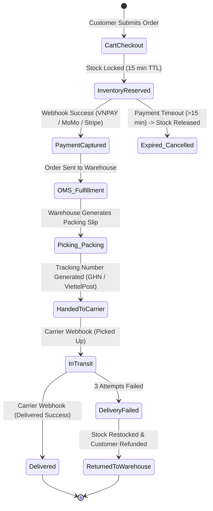
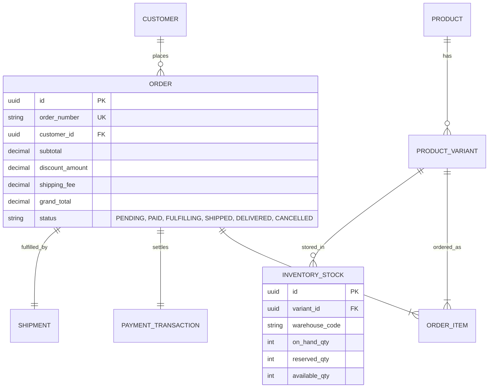

# 🛍️ E-Commerce & Retail Systems Architecture Guide

> **Domain:** E-Commerce OMS (Order Management System), WMS (Warehouse), PIM (Product Information), and Pricing/Promotion Engines.  
> **Target:** E-Commerce BAs, Retail Product Managers, Solutions Architects.

---

## 1. E-Commerce Order Fulfillment & Inventory State Machine



---

## 2. E-Commerce Core Entities & Data Architecture



---

## 3. EARS Requirements & Gherkin Scenarios

### EARS Requirements
* **[REQ-ECOMM-001 - Event-Driven]:** *WHEN* customer initiates checkout, *THE SYSTEM SHALL* reserve inventory stock with a 15-minute Time-To-Live (TTL).
* **[REQ-ECOMM-002 - State-Driven]:** *WHILE* order status is `IN_TRANSIT`, *THE SYSTEM SHALL* poll carrier webhook every 2 hours if no update received.
* **[REQ-ECOMM-003 - Unwanted Behavior]:** *IF* concurrent orders request remaining stock $qty = 1$, *THEN THE SYSTEM SHALL* apply database row-level locking to allow only 1 order.

### Gherkin BDD Scenario
```gherkin
Feature: E-Commerce Inventory Concurrency & Flash Sale

  Scenario: Preventing Overselling during Flash Sale
    Given Product "IPHONE-15-PRO" has available quantity = 1
    When Customer A and Customer B click "Buy Now" at the exact same millisecond
    Then The system shall acquire a row-level lock on inventory table
    And Customer A transaction shall succeed with Order Status "PAID"
    And Customer B transaction shall fail with error "ERR_OUT_OF_STOCK"
    And Final inventory stock shall be exactly 0
```
