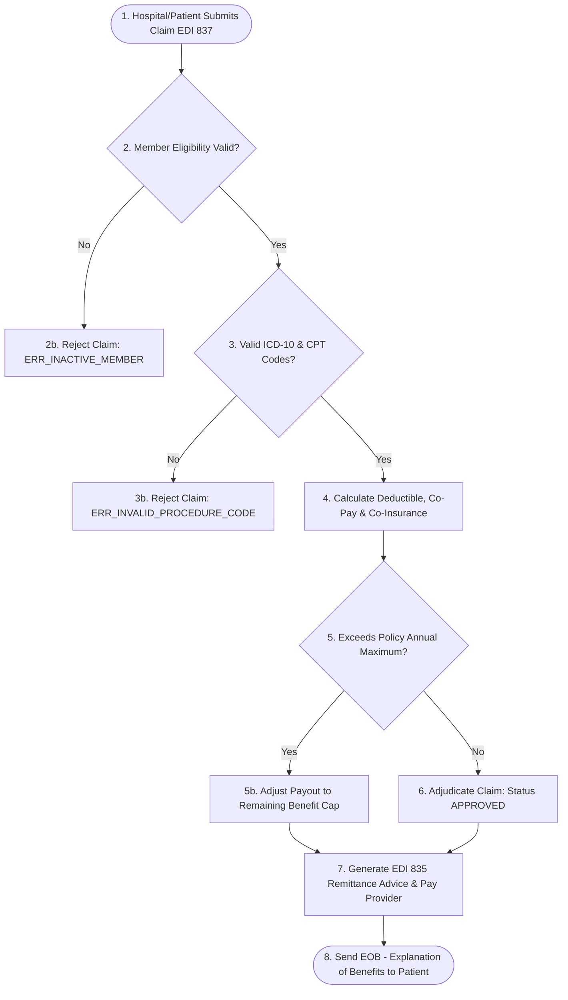

# 🏥 Health Insurance Claims & Policy Lifecycle Guide

> **Domain:** Health Insurance, Claims Adjudication Engine, Prior Authorization, HIPAA / ICD-10 / CPT Standards.  
> **Target:** Healthcare BAs, InsurTech Product Managers, and Software Engineers.

---

## 1. Health Insurance Claim Adjudication Workflow



---

## 2. Health Insurance Cost Sharing Formulas

| Term | Definition | Example Scenario ($10,000 Hospital Bill) |
| :--- | :--- | :--- |
| **Deductible** (Mức khấu trừ) | Số tiền bệnh nhân phải tự trả 100% trước khi bảo hiểm bắt đầu chi trả. | Giả sử Deductible = $1,000 $\rightarrow$ Bệnh nhân trả $1,000 đầu tiên. Số còn lại: $9,000. |
| **Co-Payment** (Đồng chi trả cố định) | Phí cố định mỗi lần khám/nằm viện (e.g. $20/lần). | Trừ trực tiếp lúc làm thủ tục. |
| **Co-Insurance** (Tỷ lệ đồng bảo hiểm) | Tỷ lệ % phân chia sau khi trừ Deductible (e.g. 80/20). | Bảo hiểm trả 80% của $9,000 = $7,200. Bệnh nhân trả 20% = $1,800. |
| **Out-of-Pocket Maximum (OOPM)** | Trần chi phí tự trả tối đa của bệnh nhân trong 1 năm. | Nếu OOPM = $2,500, bệnh nhân chỉ trả tối đa $2,500, phần còn lại bảo hiểm bao 100%. |

---

## 3. EARS Requirements & Gherkin Acceptance Criteria

### EARS Requirements
* **[REQ-CLAIM-001 - Event-Driven]:** *WHEN* receiving electronic claim EDI 837, *THE SYSTEM SHALL* perform eligibility verification within 1500ms.
* **[REQ-CLAIM-002 - State-Driven]:** *WHILE* claim status is `PENDING_REVIEW`, *THE SYSTEM SHALL* lock claim record against concurrent edits.
* **[REQ-CLAIM-003 - Unwanted Behavior]:** *IF* procedure requires Prior Authorization and none is found, *THEN THE SYSTEM SHALL* suspend claim with status `NEED_MORE_INFO`.

### Gherkin BDD Scenario
```gherkin
Feature: Health Insurance Automated Claims Adjudication

  Scenario: In-Network Hospital Claim with Deductible & 80/20 Co-Insurance
    Given Patient has an active In-Network Silver Plan
    And Patient has paid $400 out of $1,000 annual Deductible (Remaining: $600)
    And Policy Co-Insurance rate is 80% Insurer / 20% Patient
    When Hospital submits approved claim of $5,600
    Then Patient pays $600 to satisfy remaining Deductible
    And Insurer pays 80% of remaining $5,000 = $4,000 to Hospital
    And Patient pays 20% of remaining $5,000 = $1,000 to Hospital
    And The system shall generate EDI 835 Remittance Advice of $4,000
    And The system shall update Patient OOPM accumulator
```
