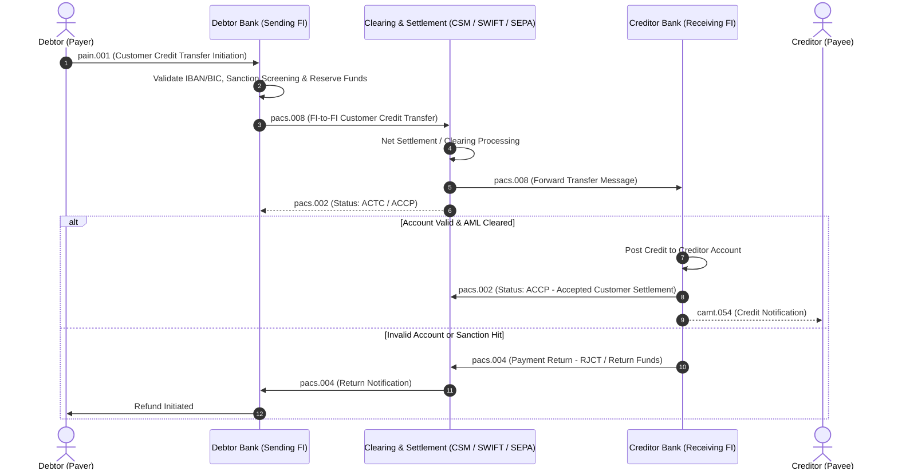

# 💳 ISO 20022 Payments & Financial Messaging Standard Guide

> **Standard:** ISO 20022 Universal Financial Industry Message Scheme, SEPA Credit Transfer (SCT), and SWIFT MX Messages.  
> **Target:** FinTech BAs, Core Banking Engineers, and AI Agents designing payment workflows.

---

## 1. ISO 20022 Message Matrix (SWIFT MT $\rightarrow$ MX Mapping)

| Business Function | Legacy SWIFT MT | ISO 20022 XML (MX) | Message Name / Purpose |
| :--- | :--- | :--- | :--- |
| **Customer Credit Transfer** | `MT103` | `pacs.008.001.xx` | FI to FI Customer Credit Transfer |
| **Financial Institution Transfer** | `MT202` / `MT202COV` | `pacs.009.001.xx` | Financial Institution Transfer |
| **Payment Status Report** | `MT199` / `ACK/NACK` | `pacs.002.001.xx` | Payment Status Report (ACCP, RJCT, PDNG) |
| **Payment Return / Reversal** | `MT103 RET` | `pacs.004.001.xx` | Payment Return (Insufficient Funds, Invalid IBAN) |
| **Payment Cancellation Request** | `MT192` / `MT292` | `camt.056.001.xx` | FI to FI Payment Cancellation Request |
| **Account Statement / Balance** | `MT940` / `MT950` | `camt.053.001.xx` | End-of-Day Bank-to-Customer Statement |
| **Debit/Credit Notification** | `MT900` / `MT910` | `camt.054.001.xx` | Real-time Debit/Credit Notification |
| **Payment Initiation (Corporate)** | `Direct Debit / Batch` | `pain.001.001.xx` | Customer-to-Bank Payment Initiation |

---

## 2. End-to-End ISO 20022 Payment Processing Flow



---

## 3. Core ISO 20022 Data Dictionary & Field Specifications

| XML Element Tag | Field Name | Type / Format | EARS Rule & Validation |
| :--- | :--- | :--- | :--- |
| `GrpHdr/MsgId` | Message Identifier | String(1..35) | *THE SYSTEM SHALL ALWAYS* ensure MsgId is globally unique per sender. |
| `GrpHdr/CreDtTm` | Creation Date Time | ISO DateTime (`YYYY-MM-DDThh:mm:ss.sssZ`) | *WHEN* generating message, *THE SYSTEM SHALL* use UTC timestamp. |
| `PmtId/EndToEndId` | End-to-End Identifier | String(1..35) | *THE SYSTEM SHALL* pass unchanged from Debtor to Creditor across all intermediaries. |
| `PmtId/UETR` | Unique End-to-End Transaction Ref | UUIDv4 (36 chars) | *WHEN* initiating transfer, *THE SYSTEM SHALL* generate RFC 4122 UUID. |
| `IntrBkSttlmAmt` | Interbank Settlement Amount | Decimal(18,2) + Currency(3) | *IF* currency is VND/JPY, *THEN* decimal digits must be 0; *IF* USD/EUR, *THEN* 2. |
| `DbtrAcct/Id/IBAN` | Debtor Account IBAN | String(15..34) | *WHEN* validating IBAN, *THE SYSTEM SHALL* execute MOD-97 check. |
| `CdtrAgt/FinInstnId/BICFI` | Creditor Agent BIC | String(8 or 11 chars) | *WHEN* routing international transfer, *THE SYSTEM SHALL* require valid ISO 9362 BIC. |

---

## 4. Gherkin BDD Acceptance Criteria

```gherkin
Feature: ISO 20022 pacs.008 Customer Credit Transfer

  Background:
    Given The Core Banking Engine is online
    And The ISO 20022 XML Validator is active

  Scenario: Happy Path - Cross-Border pacs.008 Generation
    Given Debtor balance is 5000 USD
    When Debtor submits transfer of 1200 USD to Creditor IBAN "DE89370400440532013000"
    Then The system shall deduct 1200 USD from Debtor account
    And The system shall generate XML payload conforming to "pacs.008.001.10"
    And The XML payload shall include a valid UUIDv4 "UETR" tag
    And The system shall transmit message to SWIFT Network

  Scenario: Negative Path - Invalid IBAN Checksum (MOD-97 Failure)
    Given Debtor submits payment with invalid IBAN "DE89370400440532013999"
    When The ISO XML validator parses the message
    Then The system shall reject the transaction immediately
    And The system shall emit pacs.002 with ReasonCode "AC01" (IncorrectAccountNumber)
```
