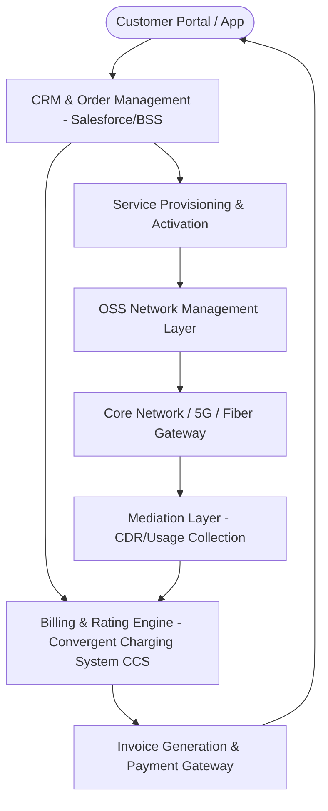

# 📱 Telecom (OSS/BSS), SaaS & Enterprise Systems Guide

> **Domain:** Telecommunications Billing (BSS), Network Operations (OSS), CRM (Salesforce) & IT Service Management (ServiceNow).  
> **Target:** Telecom BAs, SaaS Enterprise Architects, Product Managers.

---

## 1. Telecom BSS/OSS Architecture Map (eTOM Standard)



---

## 2. Core Telecom & SaaS Domain Concepts

| Term | Full Name | Function |
| :--- | :--- | :--- |
| **BSS** | Business Support Systems | Quản lý khách hàng, đơn hàng, hóa đơn, thanh toán (Customer-facing). |
| **OSS** | Operations Support Systems | Quản lý hạ tầng mạng, cấu hình dịch vụ, giám sát sự cố (Network-facing). |
| **CDR** | Call / Charge Detail Record | Bản ghi chi tiết cước cuộc gọi, SMS, dung lượng data 4G/5G đã sử dụng. |
| **MRR / ARR** | Monthly / Annual Recurring Revenue | Doanh thu định kỳ hàng tháng / hàng năm cho SaaS subscription. |
| **ITSM** | IT Service Management | Chuẩn ITIL quản lý Incident, Problem, Change Request (ServiceNow). |

---

## 3. EARS Requirements & Gherkin Acceptance Criteria

### EARS Requirements
* **[REQ-TEL-001 - Event-Driven]:** *WHEN* customer data balance reaches 0 MB, *THE SYSTEM SHALL* throttle speed to 128 kbps within 500ms and send SMS notification.
* **[REQ-TEL-002 - State-Driven]:** *WHILE* account subscription is `SUSPENDED_NON_PAYMENT`, *THE SYSTEM SHALL* block outbound calls while allowing emergency calls.
* **[REQ-TEL-003 - Unwanted Behavior]:** *IF* Mediation server fails to push CDR batch, *THEN THE SYSTEM SHALL* buffer records in local disk queue and retry every 60s.

### Gherkin BDD Scenario
```gherkin
Feature: Automated Data Cap Throttling & Top-up

  Scenario: Throttling bandwidth when 4G quota exhausted
    Given Customer has 0 MB remaining in high-speed quota
    When Customer initiates a data streaming session
    Then The BSS/OSS policy engine shall throttle bandwidth to 128 kbps
    And The system shall push SMS "Your high-speed data has ended. Reply TOPUP to buy 2GB."
```
