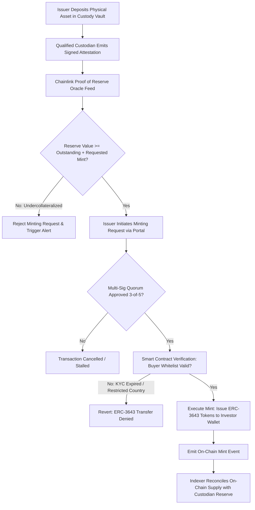
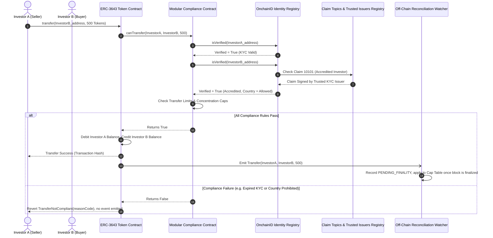
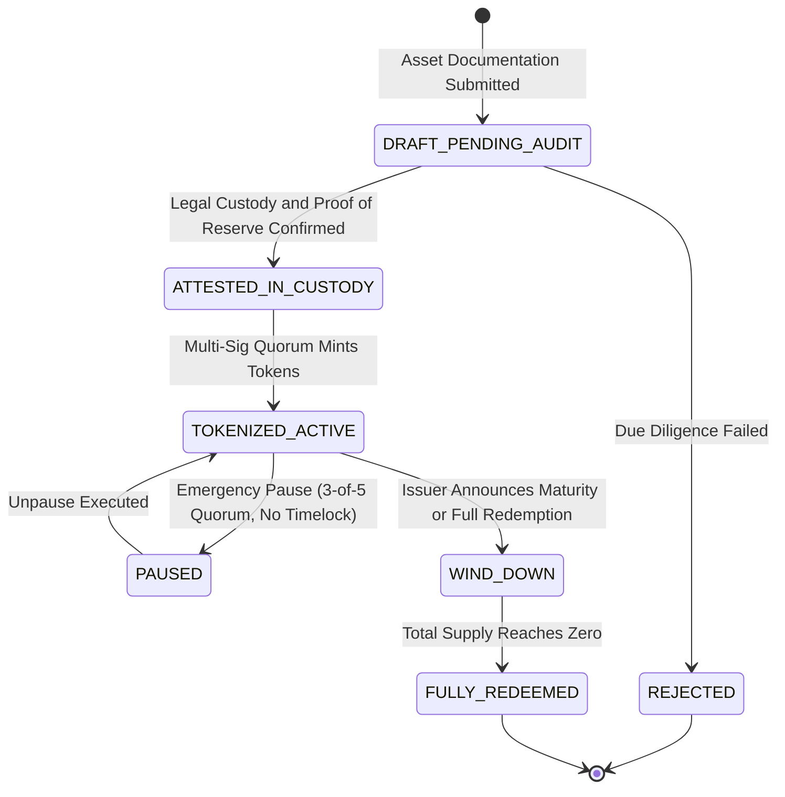
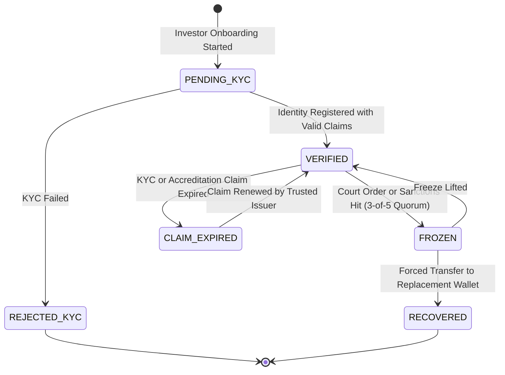
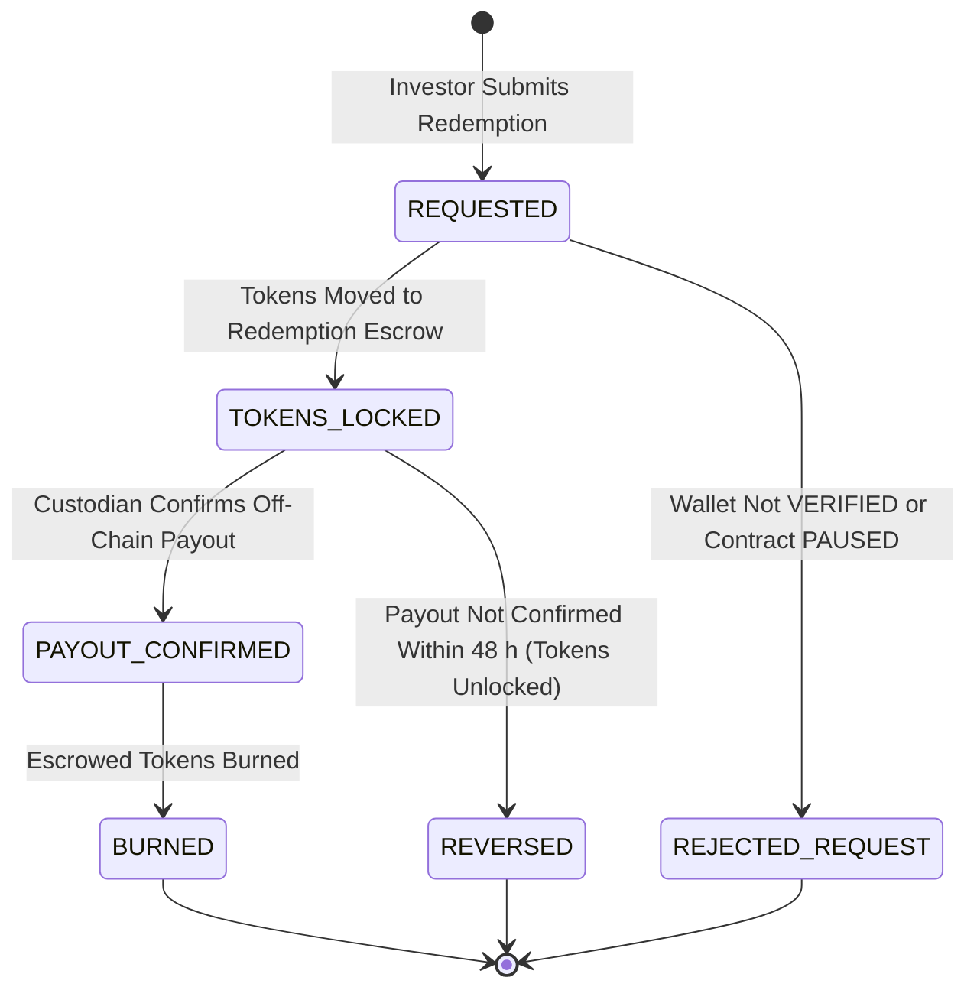
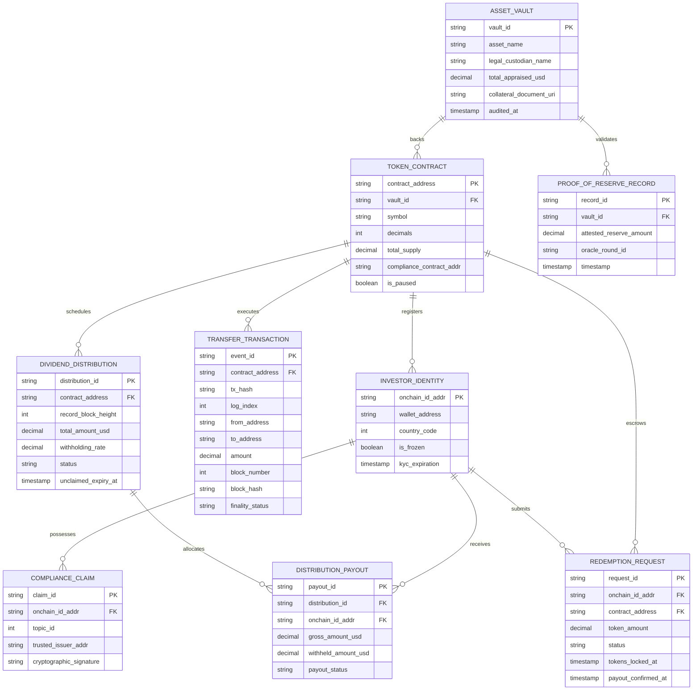

# 🪙 Master Specification: Real-World Asset (RWA) Tokenization & Institutional Compliance (ERC-3643)

> **Purpose:** Production-grade technical specification for institutional Real-World Asset (RWA) tokenization, permissioned compliance registries (ERC-3643 / T-REX), oracle-driven Proof of Reserve (PoR), atomic DvP settlement, and finality-aware on-chain/off-chain reconciliation.
>
> 📜 **Referenced Standards:** ERC-3643 (T-REX permissioned token standard, final EIP), ONCHAINID (ERC-734 / ERC-735), ERC-1400 (draft security-token proposal, never finalized — listed for comparison only), EU MiFID II (Directive 2014/65/EU) and DLT Pilot Regime (Regulation (EU) 2022/858) — tokenized securities are financial instruments and are excluded from MiCA (Regulation (EU) 2023/1114), US SEC Regulation D (506(c)) & Regulation S, FINMA Technical Guidelines for Asset Tokenization (2023), Vietnam Resolution 05/2025/NQ-CP (crypto-asset pilot, effective 9 Sep 2025 — excludes security tokens), Vietnam Law on Personal Data Protection No. 91/2025/QH15 (effective 1 Jan 2026), Chainlink Proof of Reserve Architecture.
>
> ⚖️ *Regulatory references are informational, not legal advice; re-verify applicability and dates per offering.*

---

## 1. Business Context, KPIs & Scope Boundaries

### 1.1 Business Problem & Market Rationale
Traditional private credit, real estate syndication, and sovereign debt instruments suffer from high operational friction, T+2 to T+5 settlement cycles, opaque custody verification, and manual cap-table management. Tokenizing real-world assets on public and private EVM networks unlocks 24/7 fractional liquidity, automated compliance gating, and instantaneous delivery-versus-payment (DvP) settlement while guaranteeing regulatory compliance.

### 1.2 Target Business KPIs
* **Settlement Velocity:** On-chain execution (block inclusion) $\le 15\text{ seconds}$; the off-chain register treats settlement as final at chain finality (Ethereum L1 $\approx 12.8\text{ minutes}$), replacing T+2 traditional clearing.
* **Compliance Enforcement Accuracy:** 100% automated enforcement of transfer restrictions with zero unauthorized transactions.
* **Proof of Reserve Freshness:** Collateral attestation age $\le 3,600\text{ seconds}$ (aligned with the oracle heartbeat in §6).
* **Supply Integrity:** 0 token-unit variance between on-chain total supply and the off-chain register of holders, and reserve coverage ratio $\ge 100\%$ at every attestation (reserve value may fluctuate with NAV; supply may not).

### 1.3 Scope Boundaries
* **In-Scope (MVP):**
  - Institutional investor onboarding, decentralized identity (DID) verification, and claim-holder registry management (ONCHAINID / ERC-734 / ERC-735).
  - ERC-3643 permissioned token smart contract architecture with modular compliance rules (investor country checks, max investor limits, accreditation validity).
  - Primary issuance (minting) backed by cryptographic Proof of Reserve (PoR) oracle attestations.
  - Secondary transfer compliance hooks enforcing automatic buyer/seller identity validation.
  - Asset redemption, token burning, and legal asset claim execution.
  - Multi-sig emergency controls: freeze address, force transfer under legal warrant, and pause trading.
  - Deep finality-aware blockchain watcher handling chain re-organizations (re-orgs).
* **Non-Goals / Out-of-Scope (Phase 2+):**
  - Unregulated public Automated Market Maker (AMM) liquidity pools.
  - Retail fiat on-ramp banking integration (covered via reference to payments guide).
  - Anonymous peer-to-peer transfers bypassing identity registries.

### 1.4 Jurisdiction & Asset Class Declaration
* **Worked example asset:** `US-TREASURY-01` — tokenized units of a short-term US Treasury fund, 1 token = 1 USD of NAV at issuance, offered only to accredited / professional investors.
* **Target regimes:** United States (Regulation D 506(c) for US accredited investors, Regulation S for offshore investors) and the European Union (MiFID II; secondary trading on a DLT market infrastructure under the DLT Pilot Regime). The token is a **financial instrument**, so MiCA does not apply.
* **Vietnam:** out of scope. Resolution 05/2025/NQ-CP pilots crypto assets but explicitly excludes security tokens; any offering to Vietnamese investors requires a separate legal opinion.
* **Personal data:** identity documents and KYC results stay off-chain with the KYC provider; on-chain ONCHAINID claims contain only issuer signatures and claim-data hashes. A wallet address linked to an identity is personal data under GDPR and Vietnam PDP Law 91/2025/QH15.

---

## 2. 10-Point Technical Risk & Failure Mode Audit

| Risk Dimension | Failure Scenario | Technical Mitigation Strategy | Linked REQ-ID |
| :--- | :--- | :--- | :--- |
| **1. Concurrency** | Two operator actions (e.g., mint and forced transfer) are submitted concurrently from the same operator wallet and collide on nonce, so one is silently replaced or stuck. (Investor-side double-spend is already prevented by EVM state-transition ordering.) | Single nonce manager per operator wallet serializing submissions; no shared or skipped nonces. | `REQ-RWA-16` |
| **2. Idempotency** | Off-chain custodian webhook emits duplicate deposit notification, risking double-minting of asset tokens. | Deduplication layer keyed by the unique custodian deposit reference; retries return the original result. | `REQ-RWA-13`, `REQ-RWA-11` |
| **3. Timeouts** | Blockchain RPC node network times out while transaction remains in public mempool. | Dynamic replacement-fee policy (EIP-1559 `maxPriorityFeePerGas` bumping with the same nonce) and mempool tracking across distributed nodes. | `REQ-RWA-14` |
| **4. Consistency** | Blockchain reorganization replaces a block after the backend observed a token issuance or transfer. | Finality rule instead of a fixed confirmation count: events stay `PENDING_FINALITY` and never mutate the authoritative cap table until their block is finalized (Ethereum L1 `finalized` tag ≈ 2 epochs; L2 `finalized` tag = batch included in a finalized L1 block). Orphaned provisional records are discarded and re-indexed. A reorg below the finalized block is a consensus incident: pause the contract and reconcile manually. | `REQ-RWA-07`, `REQ-RWA-08` |
| **5. State Machine** | Frozen or quarantined wallet attempts to execute token transfer or dividend claim. | ERC-3643 `canTransfer()` compliance check plus identity registry and freeze status before execution; global pause blocks all state-changing calls. | `REQ-RWA-03`, `REQ-RWA-05` |
| **6. Rate Limiting** | Automated trading bot floods RPC node with transfer verification queries. | Distributed API Gateway rate limiting enforcing 100 requests per minute per IP address and API key. | `REQ-RWA-15` |
| **7. Security & RBAC** | Compromised admin private key triggers unauthorized token minting, force transfer, or a malicious contract upgrade. | MPC / multi-signature vault requiring a 3-of-5 quorum. Emergency actions (pause, wallet freeze, forced legal transfer) execute immediately on quorum so they can meet the 15-minute SLA; contract upgrades, compliance-module changes, and trusted-issuer changes wait behind a 24-hour timelock that the quorum can cancel. | `REQ-RWA-06` |
| **8. Audit Trail** | Court order requires full lineage of token transfers between entities across 3 years. | Synchronized dual-ledger: finalized on-chain event logs indexed into an append-only relational audit store with zero truncation. | `REQ-RWA-17` |
| **9. Degradation** | Primary Chainlink PoR oracle feed halts or reports stale reserve figures. | Heartbeat watchdog detecting oracle staleness $> 3,600\text{ seconds}$, halting minting operations automatically. | `REQ-RWA-09` |
| **10. Compliance** | Investor country of residence changes to sanctioned jurisdiction post-issuance. | Dynamic identity claim revocation in OnchainID registry; token transfer hook blocks subsequent transfers immediately. Personal data kept off-chain (§1.4). | `REQ-RWA-10`, `REQ-RWA-02` |

---

## 3. Visual Models (Mermaid in Pure Markdown)

### 3.1 Primary Issuance & Proof of Reserve Architecture (Flowchart)



### 3.2 Secondary Market Transfer Compliance Sequence (Sequence Diagram)



### 3.3 Tokenized Asset Lifecycle (State Diagram)



> Wallet freezes and individual redemptions do **not** change the asset state; they follow the holder and redemption-request lifecycles below.

### 3.4 Holder Wallet Status (State Diagram)



### 3.5 Redemption Request Lifecycle (State Diagram)



### 3.6 Domain Entity Architecture (ER Diagram)



---

## 4. Formal EARS Functional Requirements

| Requirement ID | EARS Pattern | Formal Specification |
| :--- | :--- | :--- |
| **REQ-RWA-01** | *Event-Driven* | `WHEN a token minting request is initiated, THE SYSTEM SHALL query the Chainlink Proof of Reserve oracle and verify that attested reserves exceed or equal the new circulating supply before generating smart contract execution bytes.` |
| **REQ-RWA-02** | *Ubiquitous* | `THE SYSTEM SHALL ALWAYS verify that both sender and recipient wallets possess valid unexpired OnchainID claims signed by trusted KYC issuers prior to authorizing any secondary token transfer.` |
| **REQ-RWA-03** | *Unwanted Behavior* | `IF an investor wallet address is marked as frozen or fails identity registry validation, THEN THE SYSTEM SHALL revert the token transfer with the custom error TransferNotCompliant carrying a project-defined reason code, leave all balances unchanged, and record the rejection with its reason code in the off-chain compliance log by decoding the revert data of the failed transaction.` |
| **REQ-RWA-04** | *Event-Driven* | `WHEN the custodian confirms the off-chain payout for a redemption request in TOKENS_LOCKED state, THE SYSTEM SHALL burn the escrowed tokens in a single transaction, reduce total supply by the same amount, and set the request status to BURNED within 60 seconds.` |
| **REQ-RWA-05** | *State-Driven* | `WHILE the token contract is in PAUSED state, THE SYSTEM SHALL reject all incoming mint, transfer, and redemption transactions with execution revert.` |
| **REQ-RWA-06** | *Ubiquitous* | `THE SYSTEM SHALL ALWAYS require a quorum of 3 out of 5 designated hardware-secured keys for administrative actions, executing contract pause, wallet freeze, and forced legal transfer immediately upon quorum, and delaying contract upgrades, compliance module changes, and trusted issuer changes by a 24-hour timelock that the quorum can cancel.` |
| **REQ-RWA-07** | *Event-Driven* | `WHEN the blockchain indexer detects an on-chain token event, THE SYSTEM SHALL record it with finality_status PENDING_FINALITY and apply it to the authoritative off-chain cap table only after its block number is less than or equal to the chain's finalized block (Ethereum L1 finalized tag, or for an L2 the finalized tag meaning its batch is included in a finalized L1 block).` |
| **REQ-RWA-08** | *Unwanted Behavior* | `IF the indexer detects that a previously observed block hash is no longer part of the canonical chain, THEN THE SYSTEM SHALL mark all PENDING_FINALITY records from the orphaned blocks as ORPHANED, re-index events from the common ancestor block within 45 seconds, and raise a HIGH severity alert when the reorganization depth exceeds 3 blocks.` |
| **REQ-RWA-09** | *State-Driven* | `WHILE the Proof of Reserve oracle heartbeat timestamp exceeds 3,600 seconds without fresh attestation, THE SYSTEM SHALL suspend automated primary token issuance and alert the compliance operations desk.` |
| **REQ-RWA-10** | *Event-Driven* | `WHEN a trusted KYC provider revokes an investor identity claim, THE SYSTEM SHALL invoke the identity registry smart contract to synchronize revocation status within 300 seconds.` |
| **REQ-RWA-11** | *Ubiquitous* | `THE SYSTEM SHALL ALWAYS persist an immutable cryptographic hash of physical legal custodian vault deposit receipts in smart contract state metadata.` |
| **REQ-RWA-12** | *Event-Driven* | `WHEN a distribution is declared with a record block height, THE SYSTEM SHALL calculate pro-rata allocations from holder balances snapshotted at that block height and ignore every transfer finalized after it.` |
| **REQ-RWA-13** | *Unwanted Behavior* | `IF a custodian deposit notification arrives with a custodian deposit reference that has already been processed, THEN THE SYSTEM SHALL return the original processing result and SHALL NOT create a second mint request.` |
| **REQ-RWA-14** | *Unwanted Behavior* | `IF a platform-submitted operator transaction is not included in a block within 120 seconds, THEN THE SYSTEM SHALL resubmit it with the same nonce and a maxPriorityFeePerGas raised by at least 12.5 percent, up to 3 replacements, and alert operations when it remains pending.` |
| **REQ-RWA-15** | *Event-Driven* | `WHEN a client exceeds 100 requests per minute per API key on the transfer verification API, THE SYSTEM SHALL reject further requests with HTTP 429 and a Retry-After header until the rate window resets.` |
| **REQ-RWA-16** | *Ubiquitous* | `THE SYSTEM SHALL ALWAYS serialize transaction submission for each operator wallet through a single nonce manager so that no two pending transactions share a nonce and no nonce is skipped.` |
| **REQ-RWA-17** | *Ubiquitous* | `THE SYSTEM SHALL ALWAYS index every finalized token contract event into an append-only audit store keyed by chain ID, transaction hash, and log index, retained for at least 7 years or the longer period required by the declared jurisdiction.` |
| **REQ-RWA-18** | *Event-Driven* | `WHEN a VERIFIED investor submits a redemption request while the contract is not PAUSED, THE SYSTEM SHALL move the requested tokens into the redemption escrow, set the request status to TOKENS_LOCKED, and send a payout instruction to the custodian within 60 seconds.` |
| **REQ-RWA-19** | *Unwanted Behavior* | `IF the custodian has not confirmed the off-chain payout within 48 hours after a redemption request entered TOKENS_LOCKED, THEN THE SYSTEM SHALL return the escrowed tokens to the investor wallet, set the request status to REVERSED, and alert the transfer agent.` |
| **REQ-RWA-20** | *Ubiquitous* | `THE SYSTEM SHALL ALWAYS key each distribution payout by distribution ID and holder identity so that re-running a distribution job never pays the same holder twice for the same distribution.` |

> **EVM note:** a reverted transaction discards every event it emitted, so rejections can never be observed as on-chain events. They surface as revert data (custom error + reason code) and must be captured off-chain (`REQ-RWA-03`). Reason codes such as `ERC3643_WALLET_FROZEN` are project-defined; the ERC-3643 reference implementation only returns `false` from `canTransfer()`.

---

## 5. Executable Gherkin BDD Acceptance Scenarios

```gherkin
Feature: ERC-3643 Compliant Real-World Asset (RWA) Tokenization

  Background:
    Given The ERC-3643 token contract "US-TREASURY-01" is deployed
    And The identity registry has trusted KYC issuer "TRUSTED_KYC_PARTNER"
    And The Proof of Reserve oracle reports asset reserves of 100,000,000 USD

  @TC-RWA-01
  Scenario: Compliant secondary transfer between accredited investors (Happy Path)
    Given Investor "Alice" holds 10,000 tokens with valid KYC claim
    And Investor "Bob" holds an active OnchainID with valid accreditation claim
    When Investor "Alice" transfers 2,500 tokens to Investor "Bob"
    Then The modular compliance contract shall evaluate "canTransfer" to TRUE
    And Alice token balance shall decrease by 2,500
    And Bob token balance shall increase by 2,500
    And The transaction shall emit the "Transfer" event
    And The off-chain cap table shall reflect the transfer only after its block is finalized

  @TC-RWA-02
  Scenario Outline: Transfer rejected due to compliance rule failure (Negative Path)
    Given Investor "Alice" holds 5,000 tokens
    And Target recipient "Bob" status is "<recipient_status>"
    When Investor "Alice" attempts to transfer 1,000 tokens to "Bob"
    Then The smart contract execution shall revert with custom error "TransferNotCompliant"
    And The revert data shall carry reason code "<error_code>"
    And No "Transfer" event shall be emitted
    And Alice token balance shall remain unchanged at 5,000
    And The off-chain compliance log shall record the rejection with reason code "<error_code>"
    Examples:
      | recipient_status        | error_code                   |
      | UNVERIFIED_NO_ONCHAINID | ERC3643_RECIPIENT_UNVERIFIED |
      | EXPIRED_KYC_ATTESTATION | ERC3643_CLAIM_EXPIRED        |
      | SANCTIONED_JURISDICTION | ERC3643_COUNTRY_RESTRICTED   |
      | WALLET_ADDRESS_FROZEN   | ERC3643_WALLET_FROZEN        |

  @TC-RWA-03
  Scenario: Proof of Reserve oracle halts undercollateralized minting (Security Edge Case)
    Given The physical asset reserve is appraised at 10,000,000 USD
    And Outstanding circulating tokens equal 10,000,000 tokens (1:1 backing)
    When Issuer attempts to mint an additional 500,000 tokens without deposited collateral
    Then The Proof of Reserve validator shall flag reserve deficiency
    And The mint transaction shall revert with "INSUFFICIENT_COLLATERAL_RESERVE"
    And Total token supply shall remain strictly 10,000,000

  @TC-RWA-04
  Scenario: Chain reorganization before finality never corrupts the cap table (Resilience Edge Case)
    Given A transfer of 1,000 tokens from "Alice" to "Bob" is observed in block 18,400,100 with hash "0xaaa1"
    And The event is recorded with finality status "PENDING_FINALITY"
    When A 2-block reorganization replaces block 18,400,100 with canonical block hash "0xbbb2" that does not contain the transfer
    Then The indexer shall mark the transfer record from block "0xaaa1" as "ORPHANED"
    And Re-index events from the common ancestor block 18,400,099 within 45 seconds
    And The authoritative cap table shall show unchanged balances for "Alice" and "Bob"
    And The append-only audit store shall contain only finalized events

  @TC-RWA-05
  Scenario: Multi-sig emergency freeze under regulatory warrant (Governance Edge Case)
    Given Law enforcement submits a legal freeze order for compromised wallet "0xBadActor"
    When 3 out of 5 authorized governance signers submit signed freeze transactions
    Then The smart contract shall transition wallet "0xBadActor" to frozen status
    And Any subsequent transfer attempt from "0xBadActor" shall fail immediately
    And An audit log event "WalletFrozen" shall be recorded with court warrant reference

  @TC-RWA-06
  Scenario: Duplicate custodian deposit notification never double-mints (Idempotency Edge Case)
    Given Custodian deposit notification "DEP-2026-000731" for 2,000,000 USD has been processed into mint request "MR-0091"
    And The SHA-256 hash of the signed custody receipt is stored in token contract metadata
    When The custodian retries the identical notification 3 times within 60 seconds
    Then The system shall return the original result referencing "MR-0091" for each retry
    And No additional mint request shall be created
    And The token contract metadata shall hold exactly one receipt hash for "DEP-2026-000731"

  @TC-RWA-07
  Scenario: Stale Proof of Reserve attestation suspends primary issuance (Degradation Edge Case)
    Given The last Proof of Reserve attestation is 3,700 seconds old
    When Issuer submits a mint request for 100,000 tokens
    Then The system shall reject the mint request with reason "POR_ORACLE_STALE"
    And Suspend automated primary issuance until a fresh attestation is received
    And Alert the compliance operations desk

  @TC-RWA-08
  Scenario: Redemption locks tokens, then burns them only after payout confirmation
    Given Investor "Alice" is VERIFIED and holds 10,000 tokens
    When "Alice" submits a redemption request for 4,000 tokens
    Then 4,000 tokens shall move to the redemption escrow and the request shall be "TOKENS_LOCKED"
    And The custodian shall receive a payout instruction within 60 seconds
    When The custodian confirms the off-chain payout of 4,000 USD
    Then The token contract shall burn the 4,000 escrowed tokens in a single transaction
    And Total supply shall decrease by 4,000
    And The request status shall be "BURNED"

  @TC-RWA-09
  Scenario Outline: Paused contract rejects every state-changing operation
    Given The token contract "US-TREASURY-01" is in "PAUSED" state
    When An authorized party submits a "<operation>" transaction
    Then The transaction shall revert
    And All balances and total supply shall remain unchanged
    Examples:
      | operation  |
      | mint       |
      | transfer   |
      | redemption |

  @TC-RWA-10
  Scenario: Revoked KYC claim propagates to the identity registry within 300 seconds (Compliance)
    Given Investor "Bob" holds a valid KYC claim from "TRUSTED_KYC_PARTNER"
    When "TRUSTED_KYC_PARTNER" revokes the identity claim of "Bob" at time T after a sanctions hit
    Then By T + 300 seconds the identity registry shall report "Bob" as not verified
    And Any transfer to or from "Bob" after synchronization shall revert

  @TC-RWA-11
  Scenario: Stuck operator transaction is fee-bumped without nonce collisions (Concurrency & Timeout Edge Case)
    Given Operator wallet "0xOps01" submits a mint transaction with nonce 412
    And A forced-transfer transaction from "0xOps01" is requested concurrently
    When The mint transaction is not included in a block within 120 seconds
    Then The system shall resubmit nonce 412 with maxPriorityFeePerGas raised by at least 12.5 percent
    And The forced-transfer transaction shall be assigned nonce 413
    And No two pending transactions from "0xOps01" shall share a nonce

  @TC-RWA-12
  Scenario: Distribution uses the record-block snapshot, not live balances (Corporate Action)
    Given A distribution of 500,000 USD is declared with record block height 18,450,000
    And Total supply at block 18,450,000 is 10,000 tokens, of which "Alice" holds 6,000 and "Bob" holds 4,000
    When "Alice" transfers 6,000 tokens to "Bob" at block 18,450,010
    And The distribution allocation is calculated
    Then "Alice" shall be allocated 300,000 USD
    And "Bob" shall be allocated 200,000 USD

  @TC-RWA-14
  Scenario Outline: Emergency actions execute on quorum while governance changes wait for the timelock
    Given 3 out of 5 governance signers approve a "<action>" proposal at time T
    When The executor submits the "<action>" transaction at time "<submitted_at>"
    Then The execution result shall be "<result>"
    Examples:
      | action                   | submitted_at | result                     |
      | pause                    | T + 5 min    | EXECUTED                   |
      | wallet freeze            | T + 5 min    | EXECUTED                   |
      | contract upgrade         | T + 5 min    | REVERTED_TIMELOCK_ACTIVE   |
      | contract upgrade         | T + 24 h     | EXECUTED                   |
      | compliance module change | T + 23 h     | REVERTED_TIMELOCK_ACTIVE   |

  @TC-RWA-15
  Scenario: Unconfirmed redemption payout is reversed after 48 hours (Timeout Edge Case)
    Given Redemption request "RR-3301" for 4,000 tokens of "Alice" entered "TOKENS_LOCKED" at time T
    And The custodian has not confirmed the off-chain payout
    When The time reaches T + 48 hours
    Then The 4,000 escrowed tokens shall be returned to the wallet of "Alice"
    And The request status shall be "REVERSED"
    And Total supply shall remain unchanged
    And The transfer agent shall be alerted

  @TC-RWA-16
  Scenario: Re-running a distribution job never double-pays a holder (Idempotency Edge Case)
    Given Distribution "DIST-2026-Q3" has already paid 300,000 USD to "Alice" and 200,000 USD to "Bob"
    When The distribution job for "DIST-2026-Q3" is re-run after a worker crash
    Then No new payout shall be created for "Alice" or "Bob"
    And The total paid for "DIST-2026-Q3" shall remain 500,000 USD
```

---

## 6. Non-Functional Requirements & Performance SLOs

| Dimension | Metric / Parameter | Proposed Default SLO | Verification Method |
| :--- | :--- | :--- | :--- |
| **Transfer Validation Gas** | EVM Gas Cost per Transfer | $\le 85,000\text{ gas}$ | Hardhat / Foundry gas profiler |
| **Watcher Indexing Latency** | Block Ingestion & Parsing | $< 1,200\text{ ms}$ from block receipt | Prometheus indexing monitor |
| **Finality Rule** | Event eligible to update the cap table | Ethereum L1: block $\le$ `finalized` tag ($\approx$ 2 epochs, ~12.8 min). L2: block $\le$ L2 `finalized` tag (batch included in a finalized L1 block). No fixed confirmation count. | Multi-RPC consensus auditor |
| **Proof of Reserve Freshness**| Maximum Attestation Age | $\le 3,600\text{ seconds}$ | Automated Chainlink telemetry probe |
| **Availability** | Indexer & Verification API | $99.99\%$ uptime | Synthetic load generator |
| **Cap-Table Accuracy** | Discrepancy Margin | $0.0000\%$ tolerance | Hourly automated reconciliation job |
| **Emergency Multi-Sig Action**| Quorum Execution SLA | $< 15\text{ minutes}$ from quorum attainment | Disaster recovery drill |
| **RPO / RTO** | Ledger Database Recovery | $\text{RPO} \le 0\text{ (on-chain)}$ / $\text{RTO} \le 15\text{ mins}$ | Failover drill validation |

---

## 7. Production Data Dictionary

| Field Name | Data Type | Nullability | Default Value | Business Validation Rules & Constraints | Sensitive (PII/Secret) |
| :--- | :--- | :--- | :--- | :--- | :--- |
| `contract_address` | `CHAR(42)` | NOT NULL | - | Must match EVM address regex `^0x[a-fA-F0-9]{40}$` | No |
| `wallet_address` | `CHAR(42)` | NOT NULL | - | Valid EVM hexadecimal address format | Yes (personal data once linked to an identity; mapping stored off-chain only) |
| `onchain_id_address`| `CHAR(42)` | NOT NULL | - | Deployed identity smart contract address | Yes (pseudonymous identifier) |
| `token_amount` | `NUMERIC(78,0)`| NOT NULL | `0` | Raw uint256 amount in base units (no fractional part); display value = `token_amount / 10^decimals`. Must be $\ge 0$ | No |
| `kyc_expiration` | `TIMESTAMPTZ` | NOT NULL | - | Future timestamp. Transfers blocked if past date | Yes (KYC attribute, off-chain) |
| `country_code` | `INT2` | NOT NULL | - | ISO 3166-1 **numeric** code as stored by the ERC-3643 Identity Registry (`uint16`), e.g. `840` = United States | Yes (personal data when linked to an identity) |
| `claim_topic_id` | `INT8` | NOT NULL | - | Standard identity topic integer (e.g., 10101 = Accredited) | No |
| `oracle_reserve_usd`| `DECIMAL(18,2)`| NOT NULL | - | Attested fiat collateral balance reported by oracle | No |
| `tx_hash` | `CHAR(66)` | NOT NULL | - | Standard 32-byte EVM transaction hash `^0x[a-fA-F0-9]{64}$` | No |
| `log_index` | `INT4` | NOT NULL | - | Event position within its block. `(chain_id, tx_hash, log_index)` is the unique event key (one transaction can emit several transfers) | No |
| `block_hash` | `CHAR(66)` | NOT NULL | - | Hash of the block containing the event; compared against the canonical chain to detect reorganizations | No |
| `finality_status` | `VARCHAR(20)` | NOT NULL | `PENDING_FINALITY` | `PENDING_FINALITY`, `FINALIZED`, `ORPHANED`. Only `FINALIZED` events may mutate the cap table or the audit store | No |
| `holder_status` | `VARCHAR(32)` | NOT NULL | `PENDING_KYC` | `PENDING_KYC`, `VERIFIED`, `FROZEN`, `CLAIM_EXPIRED`, `RECOVERED`, `REJECTED_KYC` (see §3.4). Only `VERIFIED` may send or receive tokens | No |

---

## 8. Requirements Traceability Matrix (RTM)

| Business Goal | User Story ID | EARS Requirement | Target Smart Contract / API | Test Case (§5 tag or verification type) |
| :--- | :--- | :--- | :--- | :--- |
| **BG-RWA-01** (Solvent Issuance) | `US-RWA-101` | `REQ-RWA-01` | `TokenContract.mint()` | `TC-RWA-03` (PoR Mint Solvency Check) |
| **BG-RWA-01** (Solvent Issuance) | `US-RWA-101` | `REQ-RWA-09` | `POST /api/v1/issuance/mint-requests` | `TC-RWA-07` (Stale Oracle Suspends Issuance) |
| **BG-RWA-01** (Solvent Issuance) | `US-RWA-106` | `REQ-RWA-11`, `REQ-RWA-13` | `POST /api/v1/custody/deposit-notifications` | `TC-RWA-06` (Duplicate Deposit Notification) |
| **BG-RWA-02** (KYC Compliance) | `US-RWA-102` | `REQ-RWA-02` | `ComplianceModule.canTransfer()` | `TC-RWA-01` (Compliant Transfer) |
| **BG-RWA-02** (KYC Compliance) | `US-RWA-102` | `REQ-RWA-03` | `ComplianceModule.canTransfer()` | `TC-RWA-02` (Non-compliant Transfer Revert) |
| **BG-RWA-02** (KYC Compliance) | `US-RWA-107` | `REQ-RWA-10` | `IdentityRegistry` sync job | `TC-RWA-10` (Claim Revocation Propagation) |
| **BG-RWA-03** (Physical Redemption) | `US-RWA-103` | `REQ-RWA-04`, `REQ-RWA-18` | `POST /api/v1/redemptions` | `TC-RWA-08` (Lock, Payout, then Burn) |
| **BG-RWA-03** (Physical Redemption) | `US-RWA-111` | `REQ-RWA-19` | Redemption timeout job | `TC-RWA-15` (Payout Timeout Reversal) |
| **BG-RWA-04** (Regulatory Freeze & Control) | `US-RWA-104` | `REQ-RWA-06` | `TokenContract.setAddressFrozen()` | `TC-RWA-05` (Multi-Sig Emergency Freeze) |
| **BG-RWA-04** (Regulatory Freeze & Control) | `US-RWA-112` | `REQ-RWA-06` | Governance multi-sig + timelock | `TC-RWA-14` (Emergency vs Timelocked Actions) |
| **BG-RWA-04** (Regulatory Freeze & Control) | `US-RWA-104` | `REQ-RWA-05` | `TokenContract.pause()` | `TC-RWA-09` (Paused Contract Rejects Operations) |
| **BG-RWA-05** (Re-org Immunity & Audit) | `US-RWA-105` | `REQ-RWA-07`, `REQ-RWA-08`, `REQ-RWA-17` | `POST /api/v1/watcher/reconcile` | `TC-RWA-04` (Pre-finality Reorg Handling) |
| **BG-RWA-06** (Operational Resilience) | `US-RWA-108` | `REQ-RWA-14`, `REQ-RWA-16` | Operator transaction service | `TC-RWA-11` (Fee Bump & Nonce Serialization) |
| **BG-RWA-06** (Operational Resilience) | `US-RWA-109` | `REQ-RWA-15` | `POST /api/v1/transfers/verify` | `TC-RWA-13` (k6 load test — non-BDD) |
| **BG-RWA-07** (Corporate Actions) | `US-RWA-110` | `REQ-RWA-12` | `POST /api/v1/distributions` | `TC-RWA-12` (Record-Block Snapshot Allocation) |
| **BG-RWA-07** (Corporate Actions) | `US-RWA-110` | `REQ-RWA-20` | `POST /api/v1/distributions/{id}/run` | `TC-RWA-16` (Idempotent Distribution Re-run) |

> **Coverage:** all 20 requirements (`REQ-RWA-01`…`REQ-RWA-20`) trace to at least one test case; every TC except `TC-RWA-13` (load test) is a tagged scenario in §5.

---

## 9. Open Elicitation Questions for Stakeholders

1. **Cross-Chain Bridge Compliance:** If tokenized assets are bridged across EVM Layer-2 rollups, must the target chain deploy an identical OnchainID registry with synchronous state synchronization, or will lock-and-mint wrapped tokens be prohibited?
2. **Oracle Fallback Hierarchy:** If the primary Chainlink Proof of Reserve oracle feed halts for $> 3,600\text{ seconds}$, should the platform accept cryptographically signed attestation messages from a secondary big-four auditing firm via multi-sig injection?
3. **Partial Forced Transfers:** Under civil court asset recovery procedures, does the issuer require the technical capability to transfer a fraction of tokens from a non-cooperative wallet without freezing the residual balance?
4. **Regulatory Reporting Cadence:** Should on-chain transfer events stream in real-time to national financial supervisory API endpoints (e.g., BaFin / SEC / MAS), or does daily batched reconciliation suffice?

---

## 10. Technical Glossary & Cross-References

* **ERC-3643 (T-REX):** Open-source suite of smart contracts enabling compliant issuance and management of permissioned tokens utilizing OnchainID decentralized identity verification.
* **Delivery-versus-Payment (DvP):** A securities settlement mechanism where transfer of tokens occurs simultaneously with the transfer of payment, eliminating counterparty credit risk.
* **Proof of Reserve (PoR):** Cryptographic verification technique using decentralized oracles to continuously validate that physical or off-chain assets match on-chain token supply.
* **Finality:** The point after which a block can no longer be reverted without a consensus failure; on Ethereum PoS exposed through the `finalized` block tag.
* **Cross-Reference:** See the [ISO 20022 Payments Guide](../payments-iso20022/ISO-20022-PAYMENTS-GUIDE.md) for fiat interbank settlements and the [Data Dictionary Template](../../04-data-dictionary/DATA-DICTIONARY-TEMPLATE.md) for data catalog standards.
