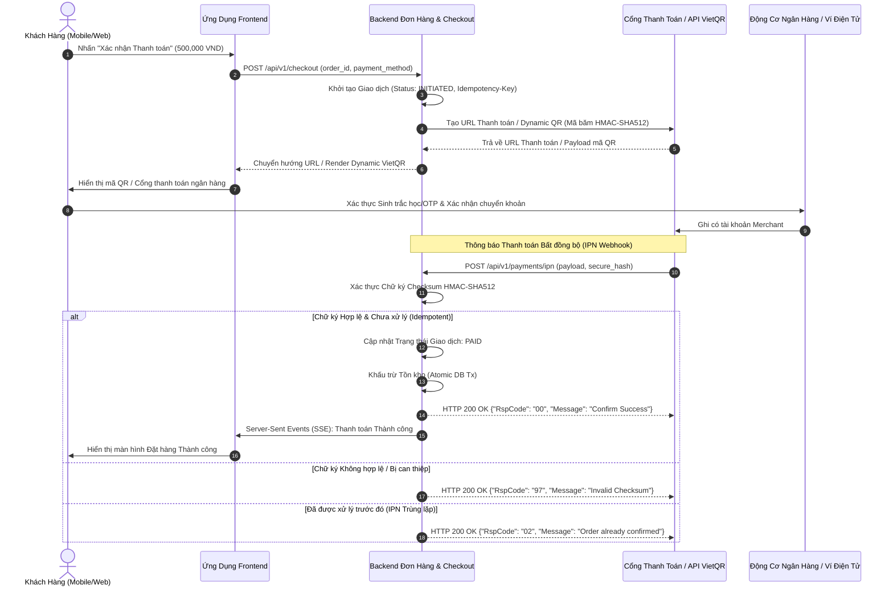
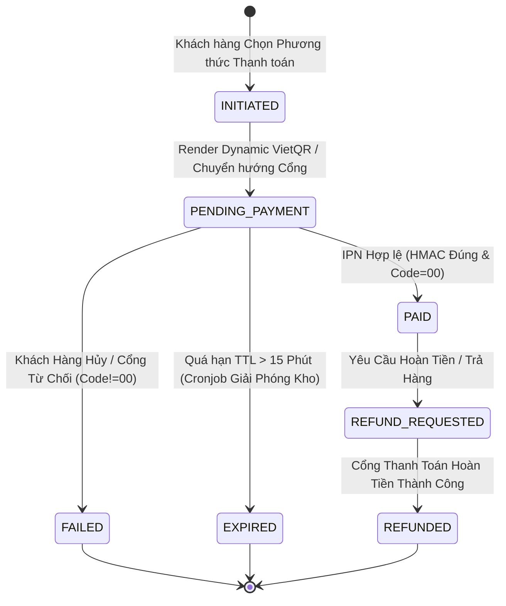

# 🇻🇳 Tài Liệu Đặc Tả Kỹ Thuật: Cổng Thanh Toán Việt Nam & VietQR Thời Gian Thực (VNPAY / MoMo / ZaloPay / VietQR)

> **Mục đích:** Đặc tả kỹ thuật chuẩn công nghiệp và case study kiến trúc thanh toán số tại Việt Nam (Tích hợp Cổng thanh toán, Dynamic VietQR NAPAS 247, Thông báo thanh toán tức thời IPN có mã băm HMAC-SHA512, Xử lý Webhook Idempotent chống trừ tiền/giao dịch trùng lặp và Đối soát).
>
> 🌐 *Phiên bản tiếng Anh:* Xem tại `docs/05-domain-knowledge/ecommerce-retail/CASE-STUDY-VIETNAM-PAYMENTS.md`.

---

## 1. Bối Cảnh Nghiệp Vụ & Kiến Trúc Khu Vực

### 1.1 Các Kênh Thanh Toán Chủ Lực Tại Việt Nam
Hệ thống thương mại số tại Việt Nam cần hỗ trợ 4 kênh thanh toán cốt lõi:
1. **VietQR / NAPAS 247 (Dynamic QR Code):** Chuyển khoản liên ngân hàng thời gian thực. Hệ thống sinh mã QR động chuẩn EMVCo chứa mã đơn hàng (`DH<order_id>`) và số tiền chính xác. Webhook ngân hàng (qua Open Banking API hoặc trung gian Casso / SePay) khớp biến động số dư và kích hoạt xác nhận đơn.
2. **Cổng Thẻ Nội Địa & Quốc Tế:** VNPAY, OnePay, VNPT Pay hỗ trợ thẻ ATM nội địa NAPAS và thẻ quốc tế Visa / Mastercard / JCB.
3. **Ví Điện Tử:** MoMo, ZaloPay, ShopeePay tích hợp qua App-to-App Deeplink hoặc quét mã QR.
4. **Thanh Toán Khi Nhận Hàng (COD):** Tính toán cước tự động và đồng bộ trạng thái giao vận với các đơn vị 3PL (GHN, GHTK, Viettel Post).

---

## 2. Kiến Trúc Thanh Toán & Xử Lý Webhook Phân Tán (Sequence Diagram)



---

## 3. Quy Tắc Phòng Chống Gian Lận, Idempotency & Đối Soát

### 3.1 Quy Tắc Bảo Mật & Kiểm Tra Checksum
* **Quy tắc 1 (Sinh Checksum Chuẩn Hóa - Canonical Sort):** Mọi request gửi đi và IPN nhận về phải được sắp xếp các khóa (key) theo thứ tự bảng chữ cái (`ASCII sort`) trước khi băm bằng thuật toán `HMAC-SHA512` với khóa bí mật chia sẻ trước (Secret Key).
* **Quy tắc 2 (Xác Thực Chống Giả Mạo Số Tiền):**
  * Khi nhận IPN từ cổng thanh toán, Backend **bắt buộc** phải so sánh giá trị `vnp_Amount` với `orders.total_amount` trong cơ sở dữ liệu chính.
  * Tuyệt đối không cập nhật trạng thái đơn hàng nếu số tiền không khớp chính xác.

### 3.2 Chiến Lược Idempotency & Thời Gian Hết Hạn (TTL)
* **Xử lý Retry Webhook:** Cổng thanh toán sẽ thử gửi lại IPN chưa được xác nhận tối đa 8 lần với cơ chế exponential backoff. Nếu đơn hàng đã ở trạng thái `PAID`, hệ thống trả về ngay `RspCode: 02` mà không thực hiện trừ tồn kho hay gửi email thông báo lần hai.
* **Thời gian sống của đơn hàng (TTL):** Phiên thanh toán Dynamic VietQR và cổng có TTL nghiêm ngặt 15 phút. Khi hết hạn, cronjob đối soát định kỳ sẽ giải phóng số lượng tồn kho đã giữ trước đó.

---

## 4. Đặc Tả Yêu Cầu Chức Năng Chuẩn EARS

| Mã Yêu Cầu | Mẫu EARS | Đặc Tả Cú Pháp Chuẩn |
| :--- | :--- | :--- |
| **REQ-PAY-01** | *Event-Driven* | `WHEN the customer clicks "Confirm Checkout", THE SYSTEM SHALL create a payment_transaction record in INITIATED state and return the Dynamic VietQR payload within 300ms.` |
| **REQ-PAY-02** | *Event-Driven* | `WHEN a valid IPN webhook arrives with valid HMAC-SHA512 and matching amount, THE SYSTEM SHALL transition order status to PAID and commit inventory in a single atomic database transaction.` |
| **REQ-PAY-03** | *Unwanted Behavior* | `IF the webhook HMAC signature is invalid or the transaction amount is mismatched, THEN THE SYSTEM SHALL reject the state change, log a HIGH-SEVERITY security alert, and return HTTP 200 {"RspCode": "97"}.` |
| **REQ-PAY-04** | *State-Driven* | `WHILE a transaction is in PENDING_PAYMENT state and elapsed time exceeds 15 minutes, THE SYSTEM SHALL transition status to EXPIRED and release reserved inventory back to available stock.` |
| **REQ-PAY-05** | *Ubiquitous* | `THE SYSTEM SHALL ALWAYS persist an Idempotency-Key and Correlation-ID for every payment request and IPN webhook to guarantee zero double-spending.` |

---

## 5. Kịch Bản Kiểm Thử Gherkin BDD

```gherkin
Feature: Xử lý Cổng Thanh Toán Việt Nam & Dynamic VietQR

  Background:
    Given Khách hàng có đơn hàng chờ #DH1009 với tổng tiền 1,200,000 VND
    And Đơn hàng đang ở trạng thái "PENDING_PAYMENT"

  Scenario: Xử lý thành công thanh toán qua IPN (Happy Path)
    Given Cổng thanh toán gửi webhook IPN:
      | order_id       | DH1009      |
      | amount         | 120000000   |
      | response_code  | 00          |
      | secure_hash    | valid_hash  |
    When Backend kiểm tra mã băm HMAC-SHA512 "valid_hash" hợp lệ
    And Số tiền nhận được khớp chính xác với đơn hàng 1,200,000 VND
    Then Hệ thống phải cập nhật trạng thái đơn hàng thành "PAID"
    And Khấu trừ số lượng tồn kho thực tế
    And Phản hồi xác nhận cho Cổng thanh toán với {"RspCode": "00", "Message": "Confirm Success"}

  Scenario: Phát hiện payload bị can thiệp sai số tiền (Negative / Phát hiện Gian lận)
    Given Kẻ tấn công giả mạo payload IPN với số tiền 10,000 VND cho đơn hàng 1,200,000 VND
    When Backend phát hiện số tiền không khớp với cơ sở dữ liệu
    Then Hệ thống phải ghi log cảnh báo kiểm toán "CRITICAL_FRAUD_ALERT"
    And Giữ nguyên trạng thái đơn hàng là "PENDING_PAYMENT"
    And Phản hồi từ chối JSON {"RspCode": "04", "Message": "Invalid Amount"}

  Scenario: Nhận webhook IPN trùng lặp (Edge Case / Idempotency)
    Given Đơn hàng #DH1009 đã ở trạng thái "PAID"
    When Cổng thanh toán gửi lại payload IPN thành công giống hệt
    Then Hệ thống phát hiện Idempotency-Key đã được xử lý trước đó
    And Bỏ qua việc trừ kho và gửi email thông báo lần 2
    And Trả về phản hồi xác nhận ngay lập tức {"RspCode": "02", "Message": "Order already confirmed"}
```

---

## 6. Sơ Đồ Máy Trạng Thái Thanh Toán (State Diagram)



---

## 7. Từ Điển Dữ Liệu Sản Xuất (Data Dictionary)

| Tên Trường | Kiểu Dữ Liệu | Nullable | Mặc Định | Quy Tắc Nghiệp Vụ & Ràng Buộc | Nhạy Cảm (PII) |
| :--- | :--- | :--- | :--- | :--- | :--- |
| `transaction_id` | `VARCHAR(64)` | NOT NULL | UUID v4 | Khóa chính | Không |
| `order_id` | `VARCHAR(32)` | NOT NULL | - | Khóa ngoại tham chiếu `orders(id)` | Không |
| `idempotency_key` | `VARCHAR(128)` | NOT NULL | - | Khóa duy nhất, chống trừ tiền trùng lặp | Không |
| `payment_method` | `ENUM` | NOT NULL | `VIETQR` | `VIETQR`, `VNPAY_ATM`, `VNPAY_QR`, `MOMO`, `ZALOPAY`, `COD` | Không |
| `amount` | `DECIMAL(15,2)`| NOT NULL | `0.00` | Số tiền $\ge 1,000$ VND. Phải bằng `order.total_amount` | Không |
| `status` | `ENUM` | NOT NULL | `INITIATED` | `INITIATED`, `PENDING_PAYMENT`, `PAID`, `FAILED`, `EXPIRED`, `REFUNDED` | Không |
| `gateway_transaction_no` | `VARCHAR(100)` | NULL | NULL | Mã tham chiếu giao dịch phía Cổng thanh toán | Không |
| `raw_ipn_payload` | `JSONB` | NULL | NULL | Toàn bộ payload IPN phục vụ audit log | Có (Che số thẻ) |
| `created_at` | `TIMESTAMPTZ` | NOT NULL | `NOW()` | Dấu thời gian chuẩn UTC | Không |
