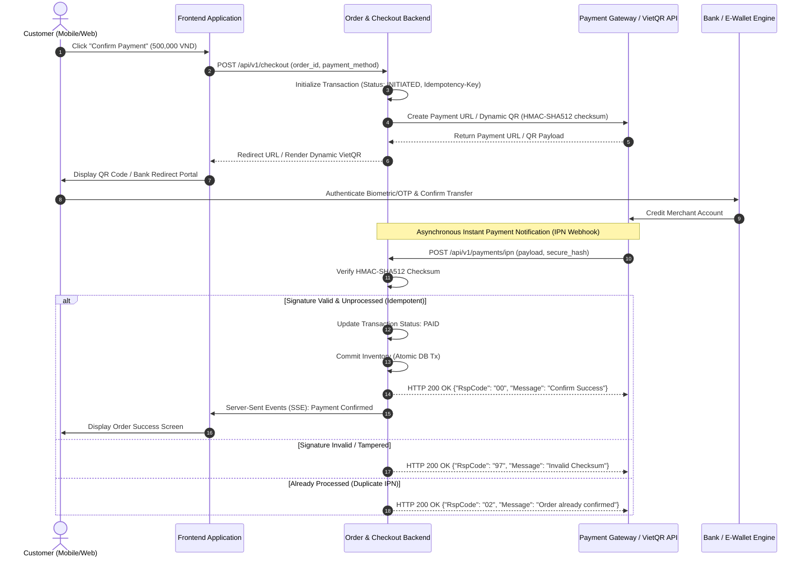
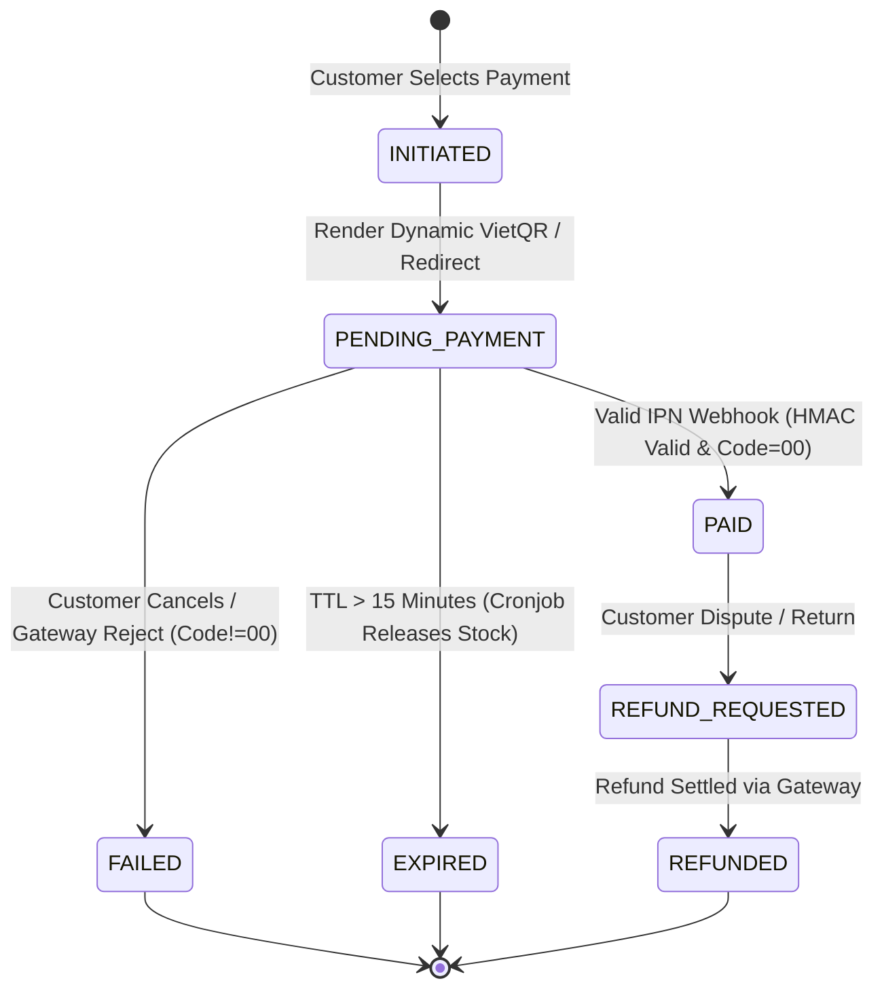

# 🇻🇳 Master Specification: Vietnam Payment Gateway & Real-Time QR (VNPAY / MoMo / ZaloPay / VietQR)

> **Purpose:** Production-grade technical specification and case study for Vietnam digital payments (Payment Gateway integration, Dynamic VietQR, HMAC-SHA512 Instant Payment Notification (IPN), Idempotent Webhook processing, and Reconciliation).
>
> 🌐 *Language Note:* A Vietnamese version is also available in `docs/05-domain-knowledge/ecommerce-retail/CASE-STUDY-VIETNAM-PAYMENTS-VI.md`.

---

## 1. Business Context & Regional Architecture

### 1.1 Core Vietnam Payment Rails
In the Vietnamese digital commerce ecosystem, systems must support 4 primary payment rails:
1. **VietQR / NAPAS 247 (Dynamic QR):** Real-time interbank push payments. The system generates an EMVCo-compliant dynamic QR code with order ID (`DH<order_id>`) and exact amount. Bank webhooks (e.g., via Open Banking API / Casso / SePay) match incoming credits and trigger order confirmation.
2. **National & International Card Gateways:** VNPAY, OnePay, VNPT Pay supporting local NAPAS debit cards and Visa/Mastercard/JCB.
3. **E-Wallets:** MoMo, ZaloPay, ShopeePay via App-to-App deeplinks or QR scanning.
4. **Cash on Delivery (COD):** Automated shipping calculation with 3PL logistics carriers (GHN, GHTK, Viettel Post).

---

## 2. Distributed Payment & Webhook Architecture (Sequence Diagram)



---

## 3. Fraud Prevention, Idempotency & Reconciliation Rules

### 3.1 Security & Checksum Rules
* **Rule 1 (Canonical Checksum Generation):** All outbound requests and inbound IPNs must have payload keys sorted alphabetically (`ASCII sort`) and hashed via `HMAC-SHA512` using the pre-shared secret key.
* **Rule 2 (Anti-Tampering Amount Verification):**
  * When receiving IPN from gateways, Backend **must** compare `vnp_Amount` against `orders.total_amount` in the primary database.
  * Never update order status if amounts mismatch.

### 3.2 Idempotency & TTL Strategy
* **IPN Retry Handling:** Gateways retry unacknowledged IPN requests up to 8 times with exponential backoff. If order state is already `PAID`, return `RspCode: 02` immediately without re-executing inventory deduction or duplicate notifications.
* **Order Time-to-Live (TTL):** Dynamic VietQR and gateway sessions have a strict 15-minute TTL. Upon expiration, a background reconciliation cron releases reserved inventory.

---

## 4. Formal EARS Functional Requirements

| Requirement ID | EARS Pattern | Formal Specification |
| :--- | :--- | :--- |
| **REQ-PAY-01** | *Event-Driven* | `WHEN the customer clicks "Confirm Checkout", THE SYSTEM SHALL create a payment_transaction record in INITIATED state and return the Dynamic VietQR payload within 300ms.` |
| **REQ-PAY-02** | *Event-Driven* | `WHEN a valid IPN webhook arrives with valid HMAC-SHA512 and matching amount, THE SYSTEM SHALL transition order status to PAID and commit inventory in a single atomic database transaction.` |
| **REQ-PAY-03** | *Unwanted Behavior* | `IF the webhook HMAC signature is invalid or the transaction amount is mismatched, THEN THE SYSTEM SHALL reject the state change, log a HIGH-SEVERITY security alert, and return HTTP 200 {"RspCode": "97"}.` |
| **REQ-PAY-04** | *State-Driven* | `WHILE a transaction is in PENDING_PAYMENT state and elapsed time exceeds 15 minutes, THE SYSTEM SHALL transition status to EXPIRED and release reserved inventory back to available stock.` |
| **REQ-PAY-05** | *Ubiquitous* | `THE SYSTEM SHALL ALWAYS persist an Idempotency-Key and Correlation-ID for every payment request and IPN webhook to guarantee zero double-spending.` |

---

## 5. Executable Gherkin BDD Acceptance Criteria

```gherkin
Feature: Vietnam Payment Gateway & Dynamic VietQR Processing

  Background:
    Given Customer has pending order #DH1009 with total amount 1,200,000 VND
    And Order is currently in "PENDING_PAYMENT" state

  Scenario: Successful IPN payment settlement (Happy Path)
    Given Payment Gateway sends IPN payload:
      | order_id       | DH1009      |
      | amount         | 120000000   |
      | response_code  | 00          |
      | secure_hash    | valid_hash  |
    When Backend validates HMAC-SHA512 checksum "valid_hash"
    And Verified amount matches order record of 1,200,000 VND
    Then System shall update order status to "PAID"
    And Commit inventory deduction atomically
    And Return acknowledgment to Gateway with {"RspCode": "00", "Message": "Confirm Success"}

  Scenario: Detect tampered amount payload (Negative / Fraud Detection)
    Given Attacker sends spoofed IPN payload with amount 10,000 VND for 1,200,000 VND order
    When Backend detects amount mismatch against database
    Then System shall log a "CRITICAL_FRAUD_ALERT" audit event
    And Preserve order status as "PENDING_PAYMENT"
    And Return rejection JSON {"RspCode": "04", "Message": "Invalid Amount"}

  Scenario: Duplicate IPN webhook received (Edge Case / Idempotency)
    Given Order #DH1009 is already in "PAID" status
    When Gateway retries sending identical successful IPN payload
    Then System shall detect existing processed Idempotency-Key
    And Skip secondary inventory deduction and email dispatch
    And Return immediate acknowledgment {"RspCode": "02", "Message": "Order already confirmed"}
```

---

## 6. Payment State Machine Diagram



---

## 7. Production Data Dictionary

| Field Name | Data Type | Nullable | Default | Business Rules & Constraints | Sensitive (PII) |
| :--- | :--- | :--- | :--- | :--- | :--- |
| `transaction_id` | `VARCHAR(64)` | NOT NULL | UUID v4 | Primary Key | No |
| `order_id` | `VARCHAR(32)` | NOT NULL | - | Foreign Key referencing `orders(id)` | No |
| `idempotency_key` | `VARCHAR(128)` | NOT NULL | - | Unique Key, prevents double-spending | No |
| `payment_method` | `ENUM` | NOT NULL | `VIETQR` | `VIETQR`, `VNPAY_ATM`, `VNPAY_QR`, `MOMO`, `ZALOPAY`, `COD` | No |
| `amount` | `DECIMAL(15,2)`| NOT NULL | `0.00` | Amount $\ge 1,000$ VND. Must strictly equal `order.total_amount` | No |
| `status` | `ENUM` | NOT NULL | `INITIATED` | `INITIATED`, `PENDING_PAYMENT`, `PAID`, `FAILED`, `EXPIRED`, `REFUNDED` | No |
| `gateway_transaction_no` | `VARCHAR(100)` | NULL | NULL | Third-party transaction reference number | No |
| `raw_ipn_payload` | `JSONB` | NULL | NULL | Full audit payload | Yes (Mask card PAN) |
| `created_at` | `TIMESTAMPTZ` | NOT NULL | `NOW()` | Timestamp in UTC | No |
