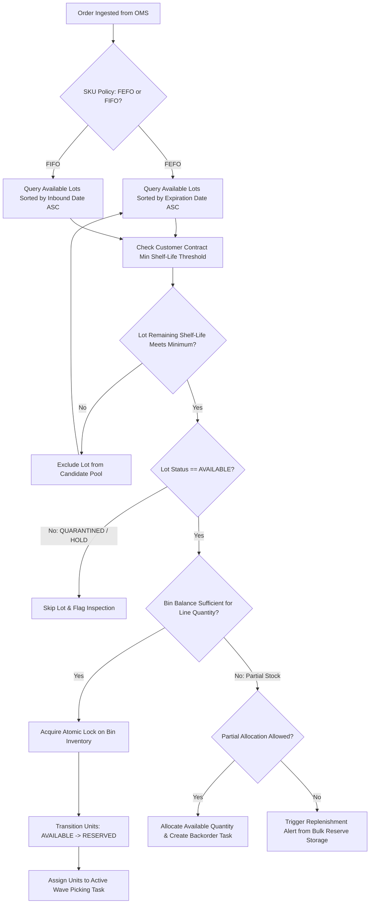
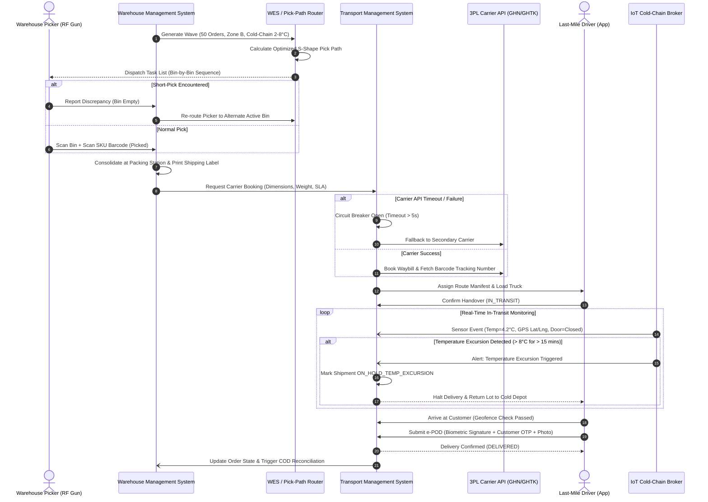
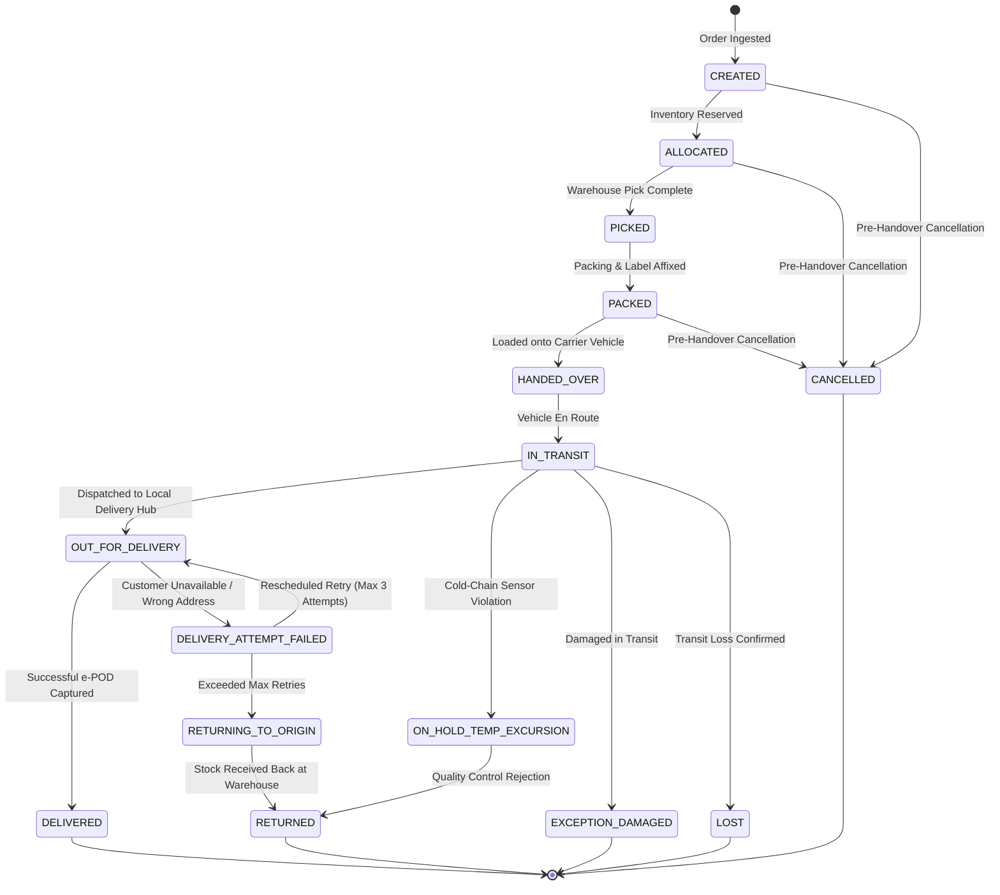
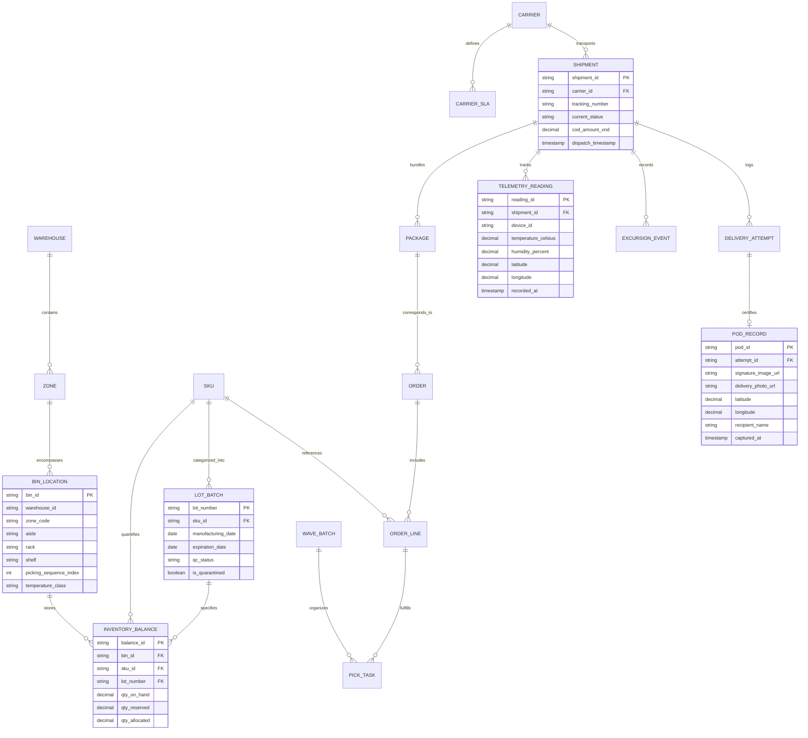

# 🚚 Master Specification: Smart Logistics, Automated WMS/TMS & Cold Chain IoT

> **Purpose:** Production-grade technical specification for enterprise Warehouse Management (WMS) and Transportation Management (TMS): dynamic bin-level inventory allocation (FEFO/FIFO), wave planning, pick-path heuristic routing, carrier dispatch, last-mile electronic Proof of Delivery (e-POD), and cold-chain IoT telemetry with automated excursion quarantine.
>
> 📜 **Referenced Standards:** GS1 General Specifications (Barcode/EPCIS), GDP (Good Distribution Practice for Pharmaceutical Products - EU Guidelines 2013/C 343/01 & US 21 CFR Part 11/205), ASTM D3103 Standard Test Method for Thermal Insulation Performance, MQTT v5.0 IoT Protocol Specification.

---

## 1. Business Context, KPIs & Scope Boundaries

### 1.1 Business Problem & Supply Chain Complexity
High-velocity omnichannel distribution operations struggle with stockout misallocations, sub-optimal picker travel paths, carrier cut-off misses, and cold-chain compliance failures. Without unified, real-time coordination between warehouse floor operations (WMS) and transportation fleets (TMS), high-value pharmaceuticals and perishables face degradation, leading to regulatory quarantine penalties and high customer churn.

### 1.2 Target Business KPIs
* **Order Fulfillment Cycle Time:** $< 45\text{ minutes}$ from OMS order ingestion to sealed carrier staging pallet.
* **Picker Travel Efficiency:** $\ge 35\%$ reduction in warehouse travel distance via heuristic pick-path optimization.
* **Inventory Allocation Accuracy:** $99.99\%$ accuracy with zero double-allocations under high concurrency ($> 1,000\text{ concurrent orders}$).
* **Cold-Chain Excursion Alert Latency:** Alert propagation and lot quarantine $< 60\text{ seconds}$ from sensor breach.
* **First-Attempt Delivery Rate (FADR):** $\ge 94\%$ across last-mile urban delivery fleets.
* **Cash-on-Delivery (COD) Reconciliation Cycle:** Automated settlement matching with 3PLs within $24\text{ hours}$.

### 1.3 Scope Boundaries
* **In-Scope (MVP):**
  - Bin-level multi-warehouse inventory management, receiving, quarantine, and putaway logic.
  - Multi-rule inventory allocation engine: First-Expired-First-Out (FEFO), First-In-First-Out (FIFO), customer shelf-life thresholds, and cross-docking bypass.
  - Dynamic wave release and batch grouping by carrier cut-off, shipping zone, and temperature class.
  - S-Shape and Largest-Gap pick-path optimization heuristics for RF gun pickers and Warehouse Execution Systems (WES).
  - Multi-carrier dynamic dispatch engine, rate shopping, automated waybill generation, and fallback rerouting.
  - Offline-first mobile e-POD capture: GPS geofencing, biometric signature/photo, recipient validation, and idempotent sync.
  - Cold-chain IoT ingestion (MQTT/Kafka), cumulative excursion budget tracking, Mean Kinetic Temperature (MKT), and automated shipment holds.
  - Last-mile failed delivery workflows (retry, RTO) and 3PL COD reconciliation (GHN, GHTK, Viettel Post).
* **Non-Goals / Out-of-Scope (Phase 2+):**
  - Autonomous Mobile Robot (AMR) motor controller firmware internals (governed via standard WES/AGV API contracts).
  - Cross-border customs declaration and maritime freight container booking.

---

## 2. 10-Point Technical Risk & Failure Mode Audit

| Risk Dimension | Failure Scenario | Technical Mitigation Strategy | Linked REQ-ID |
| :--- | :--- | :--- | :--- |
| **1. Concurrency** | Dual picking waves simultaneously allocate the final 10 units of high-demand SKU from same bin location. | Distributed pessimistic locking via Redis Redlock on `sku:bin:lot` record during allocation calculation, backed by database atomic decrement. | `REQ-WMS-02` |
| **2. Idempotency** | Driver mobile app reconnects to 4G in intermittent signal area, submitting e-POD payload 3 times. | Deduplication gateway evaluating idempotent key `delivery_attempt_id` + `client_uuid`, caching successful receipt response. | `REQ-TMS-05` |
| **3. Timeouts** | Primary 3PL carrier booking API (e.g., GHTK/GHN) times out during peak 11.11 dispatch cut-off window. | Circuit breaker (5s timeout, 3 failures open); fallback routing engine selects secondary carrier within SLA window. | `REQ-TMS-02` |
| **4. Consistency** | Picker discovers bin physical stock is empty during pick wave ("short-pick" discrepancy against system balance). | Immediate inventory adjustment workflow: marks bin as discrepancy, locks bin from active waves, and routes picker to reserve bin. | `REQ-WMS-03` |
| **5. State Machine** | Consignee attempts to cancel order after package is loaded and vehicle departs warehouse (`IN_TRANSIT`). | Strict state transition guard: order cancellation rejected once status advances beyond `HANDED_OVER`; triggers post-delivery return flow. | `REQ-TMS-03` |
| **6. Rate Limiting** | 5,000 IoT refrigerated container sensors emit telemetry readings simultaneously post-network reconnection. | High-throughput Kafka message bus with partitioning by `device_id` and consumer backpressure smoothing writes to time-series DB; per-device flood detection. | `REQ-TMS-08` |
| **7. Security & RBAC** | Rogue driver submits fake e-POD signature and marks order as delivered 2km away from customer destination. | GPS geofencing verification: e-POD submission accepted only if device coordinates lie within 100m radius of delivery address. | `REQ-TMS-01` |
| **8. Audit Trail** | Regulatory FDA/MOH auditor demands continuous temperature log for temperature-sensitive oncology drug lot. | Append-only immutable telemetry ledger storing raw sensor reading, calibration ID, and calculation timestamps for 7 years. | `REQ-TMS-09` |
| **9. Degradation** | WMS warehouse Wi-Fi network drops across cold-storage freezer vaults. | RF terminal client offline caching: stores current pick-list locally, validates barcode scans via client SQLite, and syncs upon reconnection. | `REQ-WMS-07` |
| **10. Compliance** | Perishable food lot dispatched to retail client with remaining shelf-life below contractual threshold ($< 70\%$). | Allocation engine pre-filtering: evaluates `(expiry_date - current_date) / total_shelf_life >= customer_min_threshold`. | `REQ-WMS-01` |

---

## 3. Visual Models (Mermaid in Pure Markdown)

### 3.1 Allocation & Inventory Gating Engine (Flowchart)



### 3.2 End-to-End Fulfillment, Dispatch & Delivery Lifecycle (Sequence Diagram)



### 3.3 Shipment & Delivery State Lifecycle (State Diagram)



### 3.4 Multi-Warehouse Logistics Domain Entity Architecture (ER Diagram)



---

## 4. Formal EARS Functional Requirements

### 4.1 Warehouse Management (WMS)
| Requirement ID | EARS Pattern | Formal Specification |
| :--- | :--- | :--- |
| **REQ-WMS-01** | *Event-Driven* | `WHEN order allocation executes for a perishable SKU, THE SYSTEM SHALL allocate inventory from available non-quarantined lots with the earliest expiration date (FEFO) whose remaining shelf-life exceeds the customer contractual threshold.` |
| **REQ-WMS-02** | *Ubiquitous* | `THE SYSTEM SHALL ALWAYS acquire an atomic distributed lock on the specific bin location and lot balance record during reservation calculations to prevent concurrent double-allocation.` |
| **REQ-WMS-03** | *Unwanted Behavior* | `IF a warehouse picker reports a physical inventory quantity lower than the pick-task demand (short-pick), THEN THE SYSTEM SHALL allocate the remaining quantity from the next optimal bin location and immediately flag the discrepancy bin for cycle count.` |
| **REQ-WMS-04** | *State-Driven* | `WHILE grouping pick-tasks into a wave batch, THE SYSTEM SHALL group orders sharing identical shipping zones, carrier departure cut-offs, and storage temperature requirements to minimize cross-zone picker transit.` |
| **REQ-WMS-05** | *Event-Driven* | `WHEN wave pick tasks are released to mobile RF terminals, THE SYSTEM SHALL sequence picking stops using an S-Shape traversal that visits aisles in ascending order and alternates bin direction between consecutive aisles (ascending picking_sequence_index in odd-numbered visits, descending in even-numbered visits).` |
| **REQ-WMS-06** | *State-Driven* | `WHILE an inventory lot is flagged with QC status QUARANTINED, THE SYSTEM SHALL exclude all associated bin balances from wave allocation queries and prevent manual picking release.` |
| **REQ-WMS-07** | *State-Driven* | `WHILE an RF terminal has lost connectivity to the WMS, THE SYSTEM SHALL let the picker continue the locally cached pick list, validate bin and SKU barcode scans on the device, and synchronize confirmed picks idempotently within 30 seconds after reconnection.` |

### 4.2 Transportation & Cold-Chain Management (TMS)
| Requirement ID | EARS Pattern | Formal Specification |
| :--- | :--- | :--- |
| **REQ-TMS-01** | *Event-Driven* | `WHEN a delivery driver submits an e-POD confirmation, THE SYSTEM SHALL verify that the mobile device GPS coordinates reside within a 100-meter radius of the delivery address geofence before marking the shipment as DELIVERED.` |
| **REQ-TMS-02** | *Unwanted Behavior* | `IF the primary 3PL carrier booking API fails to respond within 5,000 milliseconds or returns an HTTP 5xx error, THEN THE SYSTEM SHALL automatically divert the dispatch booking request to the designated secondary carrier.` |
| **REQ-TMS-03** | *Ubiquitous* | `THE SYSTEM SHALL ALWAYS reject order cancellation requests if the shipment lifecycle state has transitioned to HANDED_OVER or IN_TRANSIT.` |
| **REQ-TMS-04** | *Event-Driven* | `WHEN an IoT temperature telemetry reading exceeds the allowed range (2.0°C to 8.0°C) for longer than 15 continuous minutes, THE SYSTEM SHALL transition the shipment status to ON_HOLD_TEMP_EXCURSION and dispatch an emergency alert to dispatch operations within 60 seconds.` |
| **REQ-TMS-05** | *State-Driven* | `WHILE the mobile delivery application operates without cellular connectivity, THE SYSTEM SHALL store completed e-POD records in local encrypted storage and idempotently synchronize queued payloads upon network restoration.` |
| **REQ-TMS-06** | *Event-Driven* | `WHEN a shipment delivery attempt fails due to customer unavailability, THE SYSTEM SHALL reschedule the shipment for retry up to a maximum of 3 attempts before automatically initiating the Return-to-Origin (RTO) workflow.` |
| **REQ-TMS-07** | *Ubiquitous* | `THE SYSTEM SHALL ALWAYS reconcile Cash-on-Delivery (COD) cash receipts reported by 3PL carriers against order invoice balances within 24 hours of delivery confirmation, flagging discrepancies exceeding 0 VND.` |
| **REQ-TMS-08** | *Ubiquitous* | `THE SYSTEM SHALL ALWAYS buffer telemetry in a log partitioned by device_id with consumer backpressure so that reconnection bursts of up to 30,000 events per second are persisted without loss, and flag any device sending more than 10 messages per second as DEVICE_FLOODING.` |
| **REQ-TMS-09** | *Ubiquitous* | `THE SYSTEM SHALL ALWAYS persist raw temperature readings, sensor calibration IDs, and e-POD signature records in an append-only store protected by a SHA-256 hash chain and retained for 7 years.` |

---

## 5. Executable Gherkin BDD Acceptance Scenarios

```gherkin
Feature: Enterprise WMS Allocation, Cold-Chain IoT, and Last-Mile TMS

  Background:
    Given Warehouse "WH-HANOI-01" has active zones and cold storage vaults
    And SKU "VACCINE-HEPB" requires storage temperature between 2.0 and 8.0 degrees Celsius

  @TC-WMS-01
  Scenario: FEFO allocation selects earliest expiring lot meeting customer shelf-life (Happy Path)
    Given Bin "B-01-01" holds Lot "LOT-A" expiring in 45 days
    And Bin "B-01-02" holds Lot "LOT-B" expiring in 180 days
    And Customer "HOSPITAL-CENTRAL" requires minimum 60 days remaining shelf-life
    When An order for 100 units of "VACCINE-HEPB" is processed for "HOSPITAL-CENTRAL"
    Then The allocation engine shall reject "LOT-A" due to insufficient remaining shelf-life
    And The allocation engine shall allocate 100 units from "LOT-B"
    And "LOT-B" reserved inventory shall increase by 100

  @TC-WMS-02
  Scenario Outline: Customer contractual shelf-life rejection threshold (Validation Matrix)
    Given Customer has a minimum remaining shelf-life policy of "<min_percent>%"
    And Lot "LOT-TEST" has total shelf-life of 300 days and remaining life of "<remaining_days>" days
    When Allocation evaluation executes for the order line
    Then The allocation decision shall be "<decision>"
    Examples:
      | min_percent | remaining_days | decision |
      | 50          | 200            | ACCEPTED |
      | 70          | 200            | REJECTED |
      | 80          | 250            | ACCEPTED |
      | 85          | 250            | REJECTED |

  @TC-WMS-03
  Scenario: High-concurrency allocation race condition prevents double-allocation (Concurrency Edge Case)
    Given Bin "A-12-04" has exactly 50 available units of SKU "INSULIN-GLARGINE"
    When Wave "WAVE-101" requests allocation for 50 units
    And Wave "WAVE-102" concurrently requests allocation for 50 units within the same millisecond
    Then Exactly one wave shall successfully acquire the distributed lock and allocate 50 units
    And The competing wave shall receive an INSUFFICIENT_STOCK allocation result
    And Total allocated units in bin "A-12-04" shall not exceed 50

  @TC-WMS-04
  Scenario: Short-pick is re-allocated from the next bin and flagged for cycle count (Consistency Edge Case)
    Given A pick task requires 40 units of SKU "INSULIN-GLARGINE" from bin "A-12-04"
    And Bin "A-12-05" holds 60 allocatable units of the same SKU
    When The picker reports only 25 units physically present in bin "A-12-04"
    Then The system shall allocate the remaining 15 units from bin "A-12-05"
    And Flag bin "A-12-04" for cycle count with status "DISCREPANCY"

  @TC-WMS-05
  Scenario: Wave planner groups orders by zone, carrier cut-off, and temperature class
    Given Orders "ORD-1" and "ORD-2" ship from zone "B" with carrier "GHN" cut-off 15:00 at temperature class "2-8C"
    And Order "ORD-3" ships from zone "B" with carrier "GHN" cut-off 15:00 at temperature class "AMBIENT"
    When The wave planner builds waves
    Then "ORD-1" and "ORD-2" shall be grouped into the same wave
    And "ORD-3" shall be placed in a different wave

  @TC-WMS-06
  Scenario: Released wave is sequenced with an S-Shape traversal
    Given A released wave has pick stops in aisles 1, 2, and 3 with picking sequence indices 10, 20, and 30 in each aisle
    When The pick list is generated for the RF terminal
    Then Aisle 1 stops shall be sequenced 10, 20, 30
    And Aisle 2 stops shall be sequenced 30, 20, 10
    And Aisle 3 stops shall be sequenced 10, 20, 30

  @TC-WMS-07
  Scenario: Quarantined lot is never allocated or manually released (Negative Path)
    Given Lot "LOT-Q7" of SKU "VACCINE-HEPB" has QC status "QUARANTINED"
    And Lot "LOT-Q7" is the earliest-expiring lot with stock on hand
    When An order for 50 units of "VACCINE-HEPB" is allocated
    Then The allocation engine shall not allocate any unit from "LOT-Q7"
    And A supervisor attempt to release a manual pick from "LOT-Q7" shall be rejected

  @TC-WMS-08
  Scenario: RF terminal continues picking offline and syncs idempotently (Degradation Edge Case)
    Given Picker "P-017" has downloaded pick list "PL-5521" with 12 stops
    When The RF terminal loses Wi-Fi connectivity in freezer vault "F-02" after stop 4
    Then The picker shall continue stops 5 to 12 using the cached pick list
    And Each bin and SKU barcode scan shall be validated on the device
    And After reconnection the confirmed picks shall be synchronized within 30 seconds
    And Re-sending the same pick confirmations shall not change inventory a second time

  @TC-TMS-01
  Scenario: Cold-chain temperature excursion triggers automated shipment quarantine (IoT Edge Case)
    Given Shipment "SHP-COLD-9981" is in transit with 500 vials of "VACCINE-HEPB"
    And The configured temperature range is between 2.0 and 8.0 degrees Celsius
    When An IoT sensor transmits a temperature reading of 10.5 degrees Celsius sustained for 16 minutes
    Then The TMS telemetry engine shall detect an unrecoverable temperature excursion
    And Transition shipment status to "ON_HOLD_TEMP_EXCURSION"
    And Emit an urgent alert to the driver to return the container to the nearest cold-storage hub
    And Prevent delivery completion in the driver mobile application

  @TC-TMS-02
  Scenario: Offline e-POD capture and idempotent sync without duplicate delivery events (TMS Edge Case)
    Given The driver arrives at customer location with no cellular signal
    When The driver captures recipient signature and photo confirmation
    And The mobile app generates client UUID "EPOD-UUID-8899"
    And The mobile app syncs the payload 2 times upon reconnecting to 4G
    Then The TMS API shall accept the first sync and record delivery status as "DELIVERED"
    And The second sync shall return HTTP 200 OK with cached idempotency response
    And Exactly one delivery confirmation event shall be published to the message broker

  @TC-TMS-03
  Scenario: e-POD submitted outside the delivery geofence is rejected (Security Negative Path)
    Given Shipment "SHP-0000045122" is "OUT_FOR_DELIVERY" with a 100-meter geofence around the delivery address
    When The driver submits an e-POD from coordinates 2 kilometers away from the delivery address
    Then The system shall reject the e-POD with reason "OUTSIDE_GEOFENCE"
    And The shipment shall remain in "OUT_FOR_DELIVERY"

  @TC-TMS-04
  Scenario: Primary carrier timeout diverts booking to the secondary carrier (Timeout Edge Case)
    Given Primary carrier "GHN" booking API does not respond within 5,000 milliseconds
    And Secondary carrier "GHTK" is designated for zone "HN-URBAN"
    When TMS requests a waybill for package "PKG-77120"
    Then The system shall abort the GHN booking request after 5,000 milliseconds
    And Book the waybill with "GHTK"
    And Record the failover reason "PRIMARY_CARRIER_TIMEOUT" on the shipment

  @TC-TMS-05
  Scenario Outline: Cancellation is rejected once the shipment has been handed over (State Guard)
    Given Shipment "SHP-0000045123" is in state "<state>"
    When The consignee requests order cancellation
    Then The system shall reject the cancellation with reason "SHIPMENT_ALREADY_HANDED_OVER"
    And The shipment shall remain in state "<state>"
    Examples:
      | state       |
      | HANDED_OVER |
      | IN_TRANSIT  |

  @TC-TMS-06
  Scenario: Third failed delivery attempt starts Return-to-Origin
    Given Shipment "SHP-0000045120" has 2 failed delivery attempts due to customer unavailability
    When The third delivery attempt fails due to customer unavailability
    Then The system shall not schedule a fourth attempt
    And Transition the shipment to "RETURNING_TO_ORIGIN"
    And Initiate the Return-to-Origin workflow

  @TC-TMS-07
  Scenario: COD amount mismatch reported by the 3PL is flagged within 24 hours
    Given Shipment "SHP-0000045121" was delivered with a COD invoice balance of 1,250,000 VND
    When Carrier "GHTK" reports a collected COD amount of 1,200,000 VND within 24 hours of delivery confirmation
    Then The reconciliation job shall flag a discrepancy of 50,000 VND
    And Route the shipment to the COD exception queue

  @TC-TMS-09
  Scenario: Cold-chain audit records are append-only and tamper-evident (Compliance)
    Given Temperature readings for lot "LOT-B" are stored in the append-only telemetry store with a SHA-256 hash chain
    When An operator attempts to modify a stored reading from 9.1 to 7.9 degrees Celsius
    Then The store shall reject the modification
    And A hash-chain verification over a copy containing an altered record shall identify the position of the altered record
```

---

## 6. Non-Functional Requirements & Performance SLOs

| Dimension | Metric / Parameter | Proposed Default SLO | Verification Method |
| :--- | :--- | :--- | :--- |
| **Allocation Engine Speed** | Wave Batch Processing | P95 $< 500\text{ ms}$ for 500 orders / 5,000 lines against $\ge 100,000$ SKU-bins | K6 load test script |
| **IoT Telemetry Ingestion** | Throughput & Concurrency | 10,000 events/sec sustained, 30,000 events/sec burst | Distributed Kafka benchmark |
| **Excursion Alert Latency**| Sensor Breach to Dispatch Alert| P95 $< 60\text{ seconds}$ end-to-end | Synthetic anomaly injector |
| **Inventory Accuracy** | Cycle Count Variance | $\ge 99.5\%$ physical vs system balance accuracy | Monthly cycle count audit |
| **e-POD Offline Sync** | Sync Queue Ingestion | P95 $< 30\text{ seconds}$ post-reconnection for 72h queue | Network simulation test |
| **Carrier Failover Time** | Booking API Failover | $< 5\text{ seconds}$ to engage secondary 3PL | Chaos engineering network drop |
| **System Availability** | WMS & TMS Operational Uptime | $99.9\%$ during warehouse operating hours (20/7) | Datadog availability monitor |
| **RPO / RTO** | Operational Database Recovery | $\text{RPO} \le 5\text{ mins}$ / $\text{RTO} \le 30\text{ mins}$ | Disaster recovery simulation |

---

## 7. Production Data Dictionary

| Field Name | Data Type | Nullability | Default Value | Business Validation Rules & Constraints | Sensitive (PII/Secret) |
| :--- | :--- | :--- | :--- | :--- | :--- |
| `bin_id` | `VARCHAR(32)` | NOT NULL | - | Format `WH-ZONE-AISLE-RACK-SHELF` (e.g., `HN1-B-04-02-1`) | No |
| `sku_code` | `VARCHAR(64)` | NOT NULL | - | Alphanumeric SKU identifier matching catalog | No |
| `lot_number` | `VARCHAR(64)` | NOT NULL | - | Manufacturer batch code | No |
| `qty_on_hand` | `DECIMAL(12,3)`| NOT NULL | `0.000` | Current physical units inside bin. Must be $\ge 0$ | No |
| `qty_reserved` | `DECIMAL(12,3)`| NOT NULL | `0.000` | Units allocated to active picking waves | No |
| `expiration_date` | `DATE` | NOT NULL | - | Lot expiry date. Must be valid future date upon receiving | No |
| `temperature_celsius`| `DECIMAL(5,2)` | NOT NULL | - | Valid sensor reading range $-50.00$ to $+70.00$ | No |
| `shipment_id` | `VARCHAR(32)` | NOT NULL | - | Unique fulfillment tracking identifier `^SHP-[0-9]{10}$` | No |
| `pod_signature_url` | `VARCHAR(512)`| NULL | - | S3 encrypted pre-signed URL containing PNG biometric signature | Yes (PII) |
| `cod_amount_vnd` | `DECIMAL(15,0)`| NOT NULL | `0` | Cash-on-delivery currency value in VND | No |

---

## 8. Requirements Traceability Matrix (RTM)

| Business Goal | User Story ID | EARS Requirement | Target Microservice / API | Test Case (§5 tag or verification type) |
| :--- | :--- | :--- | :--- | :--- |
| **BG-LOG-01** (FEFO Accuracy) | `US-WMS-201` | `REQ-WMS-01` | `POST /api/v1/wms/allocate` | `TC-WMS-01`, `TC-WMS-02` (FEFO & Shelf-Life Validation) |
| **BG-LOG-01** (FEFO Accuracy) | `US-WMS-204` | `REQ-WMS-06` | `POST /api/v1/wms/allocate` | `TC-WMS-07` (Quarantined Lot Exclusion) |
| **BG-LOG-02** (Zero Double-Allocation) | `US-WMS-202` | `REQ-WMS-02` | `POST /api/v1/wms/reserve-lock` | `TC-WMS-03` (Concurrent Allocation Race) |
| **BG-LOG-02** (Zero Double-Allocation) | `US-WMS-203` | `REQ-WMS-03` | `POST /api/v1/wms/pick-tasks/{id}/short-pick` | `TC-WMS-04` (Short-Pick Re-allocation) |
| **BG-LOG-06** (Picking Productivity) | `US-WMS-205` | `REQ-WMS-04` | `POST /api/v1/wms/waves` | `TC-WMS-05` (Wave Grouping) |
| **BG-LOG-06** (Picking Productivity) | `US-WMS-205` | `REQ-WMS-05` | `POST /api/v1/wms/waves/{id}/release` | `TC-WMS-06` (S-Shape Sequencing) |
| **BG-LOG-06** (Picking Productivity) | `US-WMS-206` | `REQ-WMS-07` | `POST /api/v1/wms/pick-confirmations/sync` | `TC-WMS-08` (Offline RF Picking) |
| **BG-LOG-03** (Cold-Chain Quarantine) | `US-TMS-301` | `REQ-TMS-04` | `POST /api/v1/tms/telemetry` | `TC-TMS-01` (Excursion Threshold Alert & Hold) |
| **BG-LOG-03** (Cold-Chain Quarantine) | `US-TMS-304` | `REQ-TMS-08` | `POST /api/v1/tms/telemetry` | `TC-TMS-08` (Kafka burst benchmark — non-BDD) |
| **BG-LOG-03** (Cold-Chain Quarantine) | `US-TMS-305` | `REQ-TMS-09` | Telemetry audit store | `TC-TMS-09` (Append-only Hash Chain) |
| **BG-LOG-04** (Carrier SLA Failover) | `US-TMS-302` | `REQ-TMS-02` | `POST /api/v1/tms/dispatch/book` | `TC-TMS-04` (3PL Timeout Failover) |
| **BG-LOG-05** (Tamper-Proof e-POD) | `US-TMS-303` | `REQ-TMS-01` | `POST /api/v1/tms/pod` | `TC-TMS-03` (Geofence Rejection) |
| **BG-LOG-05** (Tamper-Proof e-POD) | `US-TMS-303` | `REQ-TMS-05` | `POST /api/v1/tms/pod/sync` | `TC-TMS-02` (Offline Idempotent Sync) |
| **BG-LOG-07** (Last-Mile & COD Integrity) | `US-TMS-306` | `REQ-TMS-03` | `POST /api/v1/orders/{id}/cancel` | `TC-TMS-05` (Post-Handover Cancellation Guard) |
| **BG-LOG-07** (Last-Mile & COD Integrity) | `US-TMS-306` | `REQ-TMS-06` | `POST /api/v1/tms/delivery-attempts` | `TC-TMS-06` (Return-to-Origin after 3 Attempts) |
| **BG-LOG-07** (Last-Mile & COD Integrity) | `US-TMS-307` | `REQ-TMS-07` | `POST /api/v1/tms/cod/reconcile` | `TC-TMS-07` (COD Discrepancy Flag) |

> **Coverage:** all 16 requirements (`REQ-WMS-01`…`07`, `REQ-TMS-01`…`09`) trace to at least one test case; every TC except `TC-TMS-08` (benchmark) is a tagged scenario in §5.

---

## 9. Open Elicitation Questions for Stakeholders

1. **Mean Kinetic Temperature (MKT) Formula:** For pharmaceutical cold-chain excursions, should the quarantine threshold trigger solely on instantaneous duration (e.g., $> 8^\circ\text{C}$ for 15 minutes) or on calculated Mean Kinetic Temperature (Haynes equation, $\Delta H / R = 83.144\text{ kJ/mol}$)?
2. **Short-Pick Tolerance Rules:** In B2B wholesale orders, if an allocated bin experiences a short-pick and alternate stock is in bulk reserve requiring a forklift replenishment ($> 20\text{ minutes}$ delay), should the wave proceed with partial shipment or hold the entire pallet?
3. **Driver Geofence Override:** In multi-story commercial buildings or underground loading docks where GPS signal degrades, what secondary verification mechanism (e.g., customer SMS OTP or building security badge barcode scan) authorizes e-POD completion?
4. **COD Cash Variance Threshold:** When reconciling 3PL cash collections with banking deposits, what discrepancy margin is handled via automated adjustment voucher versus triggering an operational fraud audit?

---

## 10. Technical Glossary & Cross-References

* **FEFO (First-Expired-First-Out):** Allocation methodology prioritizing inventory batches with the earliest expiration date regardless of receiving date.
* **e-POD (Electronic Proof of Delivery):** Digital documentation of shipment receipt capturing GPS geofencing, digital signatures, photographs, and timestamps.
* **Cross-Docking:** Direct transfer of inbound goods from receiving dock to outbound shipping dock without intermediate warehouse putaway storage.
* **Mean Kinetic Temperature (MKT):** A single calculated temperature that simulates the isothermal degradation effect of temperature fluctuations over a storage/transit period.
* **Cross-Reference:** See `docs/05-domain-knowledge/ecommerce-retail/ECOMMERCE-RETAIL-SYSTEMS-GUIDE.md` for omnichannel OMS order routing and `CASE-STUDY-VIETNAM-PAYMENTS.md` for Vietnam 3PL COD reconciliation dynamics.
